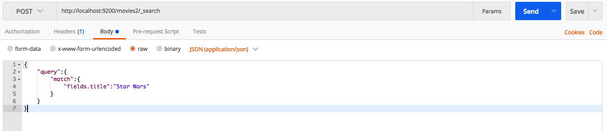
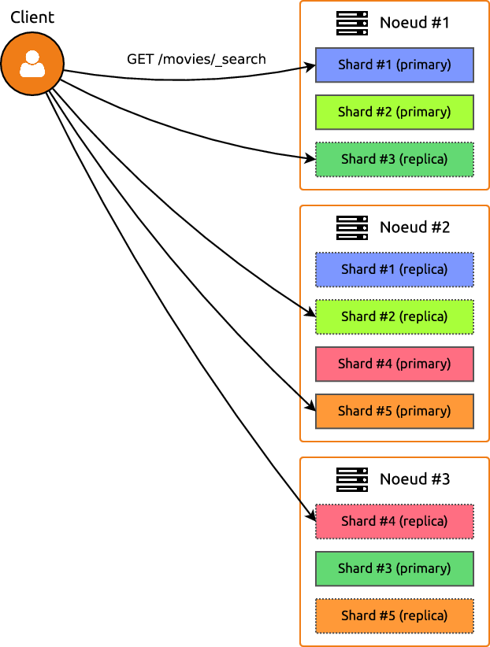

# ElasticSearch

La partie ElasticSearch de la formation

## TP 0, la prise en main

On va se rendre dans le dossier docker-elastic et lancer le proverbial 

	docker-compose up -d
	
On va manipuler ElasticSearch via Postman comme nous l'avons déjà fait avec SolR. En effet, le serveur elsaticSearch est exposé en WS et requêtable en JSON.

Pour constater que le serveur est lancé, on va appeller en `GET`dans postman l'adresse [http://localhost:9200]() Le retour est de cette forme

	{
	    "name": "IiPrEYt",
	    "cluster_name": "elasticsearch",
	    "cluster_uuid": "N_fjEe_JQcWbNFcns4wfxw",
	    "version": {
	        "number": "5.6.6",
	        "build_hash": "7d99d36",
	        "build_date": "2018-01-09T23:55:47.880Z",
	        "build_snapshot": false,
	        "lucene_version": "6.6.1"
	    },
	    "tagline": "You Know, for Search"
	}

### L'import

On va maintenant importer le fichier `movies_elastic.json` qu'on trouvera dans le repertoire share. Pour cela, on va appeler dans Postman l'url `http://localhost:9200/_bulk` en mode PUT et y attacher le fihcier movies_elastic.json en binary au body.

Les documents insérés sont de cette forme :

	"index":{"_index": "movies","_type":"movie","_id":1}}	
	{"fields" : {"directors" : ["Joseph Gordon-Levitt"],"release_date" : "2013-01-18T00:00:00Z","rating" : 7.4,"genres" : ["Comedy","Drama"],"image_url" : "http://ia.media-imdb.com/images/M/MV5BMTQxNTc3NDM2MF5BMl5BanBnXkFtZTcwNzQ5NTQ3OQ@@._V1_SX400_.jpg","plot" : "A New Jersey guy dedicated to his family, friends, and church, develops unrealistic expectations from watching porn and works to find happiness and intimacy with his potential true love.","title" : "Don Jon","rank" : 1,"running_time_secs" : 5400,"actors" : ["Joseph Gordon-Levitt","Scarlett Johansson","Julianne Moore"],"year" : 2013},"id" : "tt2229499","type" : "add"}
	
	{"index":{"_index": "movies","_type":"movie","_id":2}}
	{"fields" : {"directors" : ["Ron Howard"],"release_date" : "2013-09-02T00:00:00Z","rating" : 8.3,"genres" : ["Action","Biography","Drama","Sport"],"image_url" : "http://ia.media-imdb.com/images/M/MV5BMTQyMDE0MTY0OV5BMl5BanBnXkFtZTcwMjI2OTI0OQ@@._V1_SX400_.jpg","plot" : "A re-creation of the merciless 1970s rivalry between Formula One rivals James Hunt and Niki Lauda.","title" : "Rush","rank" : 2,"running_time_secs" : 7380,"actors" : ["Daniel Brühl","Chris Hemsworth","Olivia Wilde"],"year" : 2013},"id" : "tt1979320","type" : "add"}

Pour controller que tout s'est bien déroulé, on va effectuer un appel de tous les 'movie' de la base 'movies'. Pour cela, on va faire un appel en GET de l'url [http://localhost:9200/movies/movie/_search]()

L’URL [http://localhost:9200/movies/movie/_search]() est composée de :

* L’index : movies
* Le type : movie
* Le service utilisé : _search

### Le mapping

A l'instar de solR et des sa definition d'index et de type dans le fichier schema.xml, elasticSearch basé sur la même technologie va avoir les mêmes attentes pour optimiser sa manière de traiter ses informations. De plus, comme SolR, un import sur un chmaps non précisé dans le mapping donnera lieu à une libre interprétation de la part d'elasticSearch/Lucene sur la manière de traiter le champs.

On peut consulter le mapping générer à la volée par ElasticSearch en consultant en `GET` l'url [http://localhost:9200/movies/](). Le résultat est un fichier JSON qui décrit la manière dont les champs ont été compris.

Pour être plus cohérent, nous allons changé le type pour les acteurs, les réalisateurs, genres, et URL. Ainsi, les champs sont bien du texte (type), mais analysé comme données brutes (fields : {raw : {type : "keyword"}} )

On ne peut pas modifier le mapping d'une collection existante, on va donc importer un mapping pour une collection movie2 et réimporter la collection.

Pour cela, on passe en `PUT`dans un body formaté en JSON le mapping que l'on va trouver dans `/share/mapping_movies/mapping.json`

Si on souhaite lister les mappings : requêtes `GET` sur [http://localhost:9200/_mapping]() et si on s'apperçoit que l'on veut supprimer l'index 'movies' par exemple, il faut faire une requête `DELETE`à l'url [http://localhost:9200/movies]()

Ensuite on refait l'appel Bulk du début de cette manipulation mais avec le fichier dans `/share/mapping_movies/movies_elastic2.json` qui va correspondre à l'ajout des films dans l'index movies2

### Les requètes par query

On va effectuer et commenter ensemble les requêtes suivantes en GET :

Requête large sur toute la base de Star Wars :

	http://localhost:9200/movies2/_search?q=Star+Wars

Requête sur le titre :

	http://localhost:9200/movies2/_search?q=fields.title:Star Wars

Requête sur l'acteur :

	http://localhost:9200/movies2/_search?q=fields.actors:Harrison Ford

Requête en changeant la size (limit) par défaut 

	http://localhost:9200/movies2/_search?q=fields.actors:Harrison Ford&size=20

Requête sur titre star wars et réalisateur Georges Lucas

	http://localhost:9200/movies2/_search?q=fields.title:Star Wars AND fields.directors:George Lucas

Requête sur acteur : Harrison Ford et résumé contenant Jones

	http://localhost:9200/movies2/_search?q=fields.actors:Harrison Ford AND fields.plot:Jones

La même requête mais sans nazis

	http://localhost:9200/movies2/_search?q=actors=Harrison Ford AND fields.plot:Jones AND -fields.plot:Nazis
	
#### Les query c'est bien, le JSON c'est mieux

On va reprendre les requêtes précédentes mais plutôt que de faire de la requête on va joindre un document JSON aux requêtes `POST` sur l'url [http://localhost:9200/movies2/_search]()

Requête sur le titre :

	{
	    "query":{
	        "match":{
	            "fields.title":"Star Wars"
	        }
	    }
	}

Requête sur titre star wars et réalisateur Georges Lucas

	{"query":{
	    "bool": {
	        "should": [
	            { "match": { "fields.title": "Star Wars" }},
	            { "match": { "fields.directors": "George Lucas" }}
	        ]
	}}}
	
Une variante avec des résultats différents 

	{"query":{
	    "bool": {
	        "should": { "match": { "fields.title": "Star Wars" }},
	        "must" :  { "match": { "fields.directors": "George Lucas" }}
	}}}

Une troisième variante encore différente 

	{"query":{
	    "bool": {
	        "should": [
	            { "match_phrase": { "fields.title": "Star Wars" }},
	            { "match": { "fields.directors": "George Lucas" }}
	        ]
	}}}

Requête sur l'acteur :

	{  "query": {
	    "match": 
	        {"fields.actors":"Harrison Ford"}
	}}

Requête sur acteur : Harrison Ford et résumé contenant Jones

	{"query":{
	"bool": {
	    "should": [
	        { "match": { "fields.actors": "Harrison Ford" }},
	        { "match": { "fields.plot": "Jones" }}
	    ]
	}}}

La même requête mais sans nazis

	{"query":{
	    "bool": {
	        "should": [
	            { "match": { "fields.actors": "Harrison Ford" }},
	            { "match": { "fields.plot": "Jones" }}
	        ],
	        "must_not" : { "match" : {"fields.plot":"Nazis"}}
	}}}

#### EN JSON on passe la seconde

Nos champs sont typés et permettent des matchs olus intélligents que de la recherche textuelle simple. Par exemple les `ranges` :

	{"query":{
	    "bool": {
	            "should": [
	                { "match": { "fields.directors": "James Cameron" }},
	                { "range": { "fields.rank": {"lt":1000 }}}
	           ]
	}}}
	
Mais ce n'est probablement pas le résultat attendu pour une requête des meilleurs films de James Cameron. On va donc forcer la recherche sur le réalisateur sur la phrase et pas mot à mot et indiquer que les deux éléments ne sont pas facultatif

	{"query":{
	    "bool": {
	        "must": [
	            { "match_phrase": { "fields.directors": "James Cameron" }},
	            { "range": { "fields.rank": {"lt":1000 }}}
	        ]
	}}}

> Ce que nous venons de faire est une requête exacte, que nous aurions pu faire avec MongoDB, par exemple.

Requête sur les films de James Cameron dont la note (fields.rating) doit être supérieure à 5, mais sans être un film d'action ni dramatique (fields.genre). Il faut donc utiliser la clé "must_not", et une liste de "match" (un par genre). 

	{"query":{
	    "bool": {
	        "should": { "match": { "fields.directors": "James Cameron" }},
	        "must":{ "range": { "fields.rating": {"gte":5 }}},
	        "must_not":[
	            {"match":{"fields.genres":"Action"}},
	            {"match":{"fields.genres":"Drama"}}
	        ]
	}}}
	
Le résultat ne contient pas de film de James Cameron. Essayez d'adapter la requête pour forcer le réalisateur.

Effectuons maintenant une recherche sur les films de J.J. Abrams sortis entre 2010 et 2015 (fields.release_date). La clé "filter" sera alors appliquée avec un sous-document de type "range" avec une date de départ (from) et une date de fin (to).

	{
	    "query": {
	        "bool":{
	            "must": {"match": {"fields.directors": "J.J. Abrams"}},
	            "filter": {"range": {"fields.release_date":
	                { "from": "2010-01-01", "to": "2015-12-31"}}}
	}}}

#### Les agrégats ou les facets d'elasticSearch

On va prendre quelques éxemples d'agregations, la doc complète est présente ici : [https://www.elastic.co/guide/en/elasticsearch/reference/current/search-aggregations.html]()

##### Agrégats simples

Si on souhaite compter le nombre de film par année, on utilise l'aggregat `terms` (comme d'autres on l'a rencontré avec SolR sous forme de facets

	{"aggs" : {
	    "nb_par_annee" : {
	        "terms" : {"field" : "fields.year"}
	}}}

Pour avoir la note moyenne

	{"aggs" : {
	    "note_moyenne" : {
	        "avg" : {"field" : "fields.rating"}
	}}}

On peut conjuguer une/des fonctions d'agrégation à un filtre :

	{
	    "query" :{
	        "match" : {"fields.directors" : "George Lucas"}
	    },
	    "aggs" : {
	            "note_moyenne" : {
	                        "avg" : {"field" : "fields.rating"}
	            },
	            "rang_moyen" : {
	                        "avg" : {"field" : "fields.rank"}
	            }
	}}

On peut également réaliser des agrégats d'agrégat

	{"aggs" : {
	    "group_year" : {
	        "terms" : { "field" : "fields.year" },
	        "aggs" : {
	            "note_moyenne" : {"avg" : {"field" : "fields.rating"}},
	            "note_min" : {"min" : {"field" : "fields.rating"}},
	            "note_max" : {"max" : {"field" : "fields.rating"}}
	        }
	}}}
	
La fonction `range` déjà rencontrée

	{"aggs" : {
	    "group_range" : {
	        "range" : {
	            "field" : "fields.rating",
	            "ranges" : [
	                {"to" : 1.9},
	                {"from" : 2, "to" : 3.9},
	                {"from" : 4, "to" : 5.9},
	                {"from" : 6, "to" : 7.9},
	                {"from" : 8}
	            ]
	}}}}

On souhaite savoir maintenant les genres comportant le plus de films. Mais voilà, la clé "fields.genre" est une liste de valeurs, de base il n’est pas possible d’effectuer des groupements sur des listes. Sauf que rappelez-vous, nous avons effectué un mapping dans le chapitre précédent ! Et justement, nous avons précisé que "genres" devaient être gardés comme type "raw". De fait, il est possible d’effectuer un groupement sur le genre, mais en précisant ce "raw" :

	{"aggs" : {
	    "nb_per_genres" : {
	        "terms" : {"field" : "fields.genres.raw"}
	}}}

On peut aussi l'utiliser pour les réalisateurs

	{"aggs" : {
	    "nb_per_director" : {
	        "terms" : {"field" : "fields.directors.raw"}
	}}}

Et en conjugant plusieurs aggérgats sur les acteurs

	{"aggs" : {
	    "group_actors" : {
	        "terms" : {
	            "field" : "fields.actors.raw"
	        },
	        "aggs" : {
	            "note_moyenne" : {"avg" : {"field" : "fields.rating"}},
	            "rang_min" : {"min" : {"field" : "fields.rank"}},
	            "rang_max" : {"max" : {"field" : "fields.rank"}}
	        }
	}}}
	
>les acteurs sont triés automatiquement par le nombre de documents correspondant et non la note moyenne.

Pour aller plus loin sur le requêtage : [https://www.elastic.co/guide/en/elasticsearch/reference/current/query-dsl.html]()

## TP 2, le come-back du fainéant

Tp de manipulation des interrogations d'une base Elastic Search

[http://b3d.bdpedia.fr/ri-tpelasticdsl.html](http://b3d.bdpedia.fr/ri-tpelasticdsl.html)

## TP 2.5, le come-back du fainéant BIS

Suite du TP2, avec gestion des critères de pertinences

[http://b3d.bdpedia.fr/ri-tpranking.html](http://b3d.bdpedia.fr/ri-tpranking.html)

## TP 3, le sharding dans elasticSearch

Elastic search utilise le modèle du sharding pour sa distribution de data.

* Un index contient un ou plusieurs shards (5 par défaut).
* À chaque shard correspond un shard primaire et zéro ou plus replica shards (1 par défaut), tous stockés sur des nœuds différents.
* Chaque shard primaire contient les mêmes documents que ses replica shards.

On va commencer par lancer elasticsearch sur le premier container (les container sont préinstallés avec elasticSearch) :

