# HADOOP

## Mise en place de l'environnement

Dans le repertoire docker-hadoop, il y a un fichier docker-compose.yml que nous allons analyser ensemble et qui va permettre d'initialiser un cluster Hadoop sur nos machines.

Pour le lancer, `docker-compose up -d`

## Pratique du HDFS

### Créons notre datalake

TODO: Réécrire cette partie

Commençons par définir ce dont nous avons besoin : nous allons stocker une grande quantité de données dans un dépôt qui va être la source d'information principale, voire unique, d'un certain nombre d'applications. Dans le jargon du Big Data, un tel dépôt est appelé un Data Lake.

De l'autre côté, comment se comporteront les applications qui utilisent le master dataset ? On peut imaginer qu'elles vont lire les données au fur et à mesure qu'elles leurs parviennent, sans chercher à revenir en arrière aléatoirement. Autrement dit : les applications vont réaliser des opérations de lecture séquentielles. Par exemple, pour calculer le nombre moyen d'inscriptions par jour, une application va lire toutes les données d'une même journée dans l'ordre. Elle ne va pas avoir besoin de faire des opérations de lecture en accès aléatoire dans le master dataset.

On peut déduire de ces observations nos premiers besoins concernant le master dataset :

    Les données ne seront écrites une seule fois (Write once)

    Le master dataset ne subira que des ajouts (Append-only)

    Le master dataset sera lu de nombreuses fois (Read many times)

    Les opérations de lecture seront séquentielles (Sequential reads)

Ces besoins dessinent les contours d'une ébauche de solution pour ce qui est du stockage des donnés. Rajoutons une contrainte forte : comme le master dataset est voué à croître strictement avec le temps, il faut que la solution de stockage soit peu coûteuse. Par ailleurs, il faut que la solution retenue passe à l'échelle : il faut donc que le stockage se fasse de manière distribuée sur plusieurs machines. Mais de quelle augmentation de donnés parle-t-on au juste ? Prenons l'exemple de trois applications plus ou moins populaires qui génèrent entre 1 et 100 Go de données chaque jour :

* 1 Go/jour => 11.5 ko/s => 365 Go/an
* 10 Go/jour => 115 ko/s => 3.65 To/an
* 100 Go/jour => 1.15 Mo/s => 36.5 To/an

L'augmentation annuelle de données peut être relativement conséquente (36.5 To/an) ; par contre, le débit moyen ramené à l'échelle de la seconde est assez faible (1.15 Mo/s). Cela signifie que la solution de stockage que nous allons choisir ne devra pas nécessairement offrir une vitesse d'écriture élevée. C'est pas mal, ça nous facilite la tâche.

Pour ce qui est de la présentation des données : comme on l'a déjà mentionné, on a besoin qu'elles soient exploitables par un grand nombre d'applications différentes, éventuellement rédigée dans des langages de programmation différents. Par ailleurs, l'organisation des données risque d'évoluer avec le temps et les besoins. Comme on ne permet pas que les données de notre master dataset soient modifiées, il faut que la solution utilisée pour structurer les données dispose d'une organisation évolutive de manière native.

#### Quelle méthode va-t'on utiliser ?

##### Base de données Relationnelles (RDBMS) ?

Non : 

* couteuses
* pas adaptées pour des donées au format arbitraire
* suporteront mal l'évolution du format de données

Les RDBMS seront plus adapté aux besoins d'update de données, aux accès aléatoire et à l'algèbre relationnel bien sur.

##### Stocker des fichiers textes ?

Par exemple des fichiers semi structurés JSON ou XML. C'est simple, consomme peu de disque si on les compresse. Par contre peu d'évolution possible sur le format de donnnées.

Par exemple en JSON un nouvel utilisateur :

	{
	    "username": "alice"
	}

Plus tard on décide d'ajouter la date de naissance :

	{
	    "username": "ada",
	    "year_birth": 1815
	}
	
On va avoir une partie des fichiers avec un username, d'autres avec un username et une date de naissance. Il faudra que toutes les applications qui utiliseront ce dataset gère la présence ou l'absence de chaque données. Ce n'est clairement pas la bonne solution.

##### Un système de fichier distribué ?

Oui on va utiliser HDFS.

#### HDFS en ligne de commande

Pour commencer, nous allons manipuler hdfs en ligne de commande.

Les commandes vont prendre la forme de 

	hdfs dfs -<nom de la commande> [options] <arguments>
	
par exemple pour lister le contenu à la racine :

	hdfs dfs -ls /

La documentation de toute les commandes sur le site officiel [https://hadoop.apache.org/docs/current/hadoop-project-dist/hadoop-common/FileSystemShell.html]()

	hdfs dfs -mkdir /testCommandLine
	hdfs dfs -ls /
	hdfs dfs -touchz /testCommandLine/test.txt
	hdfs dfs -ls /testCommandLine
	
	apt-get update
	apt-get install nano -y
	
	nano testLocal.txt
	
	hdfs dfs -appendToFile testLocal.txt /testCommandLine/test.txt
	hdfs dfs -cat /testCommandLine/test.txt
	hdfs fsck /testCommandLine/test.txt -files -locations -blocks
	
	hdfs dfsadmin -allowSnapshot /testCommandLine
	hdfs dfs -createSnapshot /testCommandLine snapshot1
	hdfs dfs -touchz /testCommandLine/nouveaufichier.txt
	hdfs snapshotDiff /testCommandLine snapshot1 .
	hdfs dfs -cp -f /testCommandLine/.snapshot/snapshot1/* /testCommandLine/
	hdfs dfs -createSnapshot /testCommandLine
	
On peut accèder à l'interface d'administration du cluster via un navigateur, on y retrouvera entre autre nos snapshots :

	http://localhost:50070

##### A votre tour

Dans le name node, en ligne de commande. 

* Créer en local un fichier texte avec quelques lignes dedans
* Créer un nouveau repertoire à la racine du cluster
* Envoyer votre fichier (commande copyFromLocal) sur HDFS dans votre nouveau repertoire
* Créer un autre fichier vide dans votre repertoire hdfs
* Remplissez ce fichier avec deux fois le contenu de votre fichier texte local
* Créer un repertoire nommé backup dans le reperoire hdfs où se trouve vos fichier
* Copier tous les fichiers dans backup (commande cp)
* Lister le contenu de vos repertoires
* Récupérer en local les contenus des vos fichiers.
* Supprimer tout ce que vous venez de créer sur hdfs
* Quitter maintenant le container namenode
	
#### HDFS avec python

Rendez-vous dans le container python :

	docker exec -it docker-hadoop_python_1 bash

On va commencer par créer un fichier de connexion à HDFS en python nano `testHdfs.py` :

	import hdfs
	client = hdfs.InsecureClient("http://namenode:50070")
	
	# Affichage des données à la racine
	# l'appel à "list()" renvoie une liste de noms de fichiers et de répertoires
	client.list("/")
	
	with client.write("/pouac.txt", overwrite=True) as writer:
	     # notez que l'appel à "write()" prend en arguments un bytes et non un str
	    writer.write(b"plonk")
	
	# Lecture d'un fichier complet
	with client.read("/pouac.txt") as reader:
	    print(reader.read())
	
	# Lecture d'un fichier complet
	with client.read("/pouac.txt") as reader:
	    for line in reader:
	        print(line)

La documentation de la librarie est disponible ici [https://hdfscli.readthedocs.io/en/latest/quickstart.html#python-bindings]()

##### Manipulation libre ???

A vous de jouer

TODO: donner un énoncé

#### Apache AVRO

Avro est un framework de remote procedure call et de sérialisation de données élaboré au sein du projet Apache Hadoop. Il utilise JSON pour la définition des types de données et des protocoles, et sérialise les données dans un format binaire plus compact. La principale utilisation est dans Apache Hadoop, où il peut fournir à la fois un format de sérialisation pour les données persistantes, et un format "filaire" pour la communication entre les nœuds Hadoop, et de programmes client pour services Hadoop.

Il est similaire à Apache Thrift et Protocol Buffers, mais ne nécessite pas d'exécuter un programme de génération de code lors d'un changement de schéma (sauf si désiré pour les langages statiquement-typés).

Avro est reconnu et accepté par Apache Spark SQL comme source de données.

##### Utilisation en sérialisation

Dans le container python, on va manipuler quelques datas avec Avro.

On va importer les données suivantes pour le site fictif badassmoviecharacters.com

	[
	    {
	        "id": 1,
	        "name": "Martin Riggs"
	    },
	    {
	        "id": 2,
	        "name": "John Wick"
	    },
	    {
	        "id": 3,
	        "name": "Ripley"
	    }
	]

Voici le schéma qui décrit ces données :

	{

	    "namespace": "com.badassmoviecharacters",	
	    "name": "Character",
	    "doc": "Seriously badass characters",
	    "type": "record",
	    "fields": [
	        {"name": "name", "type": "string"},
	        {"name": "id", "type": "int"}
	    ]
	}
	
On les insère dans une fichiers pythons testSerialisationAvro.py :

	import fastavro
	
	# Définition des personnages
	characters = [
	    {
	        "id": 1,
	        "name": "Martin Riggs"
	    },
	    {
	        "id": 2,
	        "name": "John Wick"
	    },
	    {
	        "id": 3,
	        "name": "Ripley"
	    }
	
	]
	
	# Définition du schéma des données
	schema = {
	    "type": "record",
	    "namespace": "com.badassmoviecharacters",
	    "name": "Character",
	    "doc": "Seriously badass characters",
	    "fields": [
	        {"name": "name", "type": "string"},
	        {"name": "id", "type": "int"}
	    ]
	}
	
	# Ouverture d'un fichier binaire en mode écriture
	with open("characters.avro", 'wb') as avro_file:
	    # Ecriture des données
	    fastavro.writer(avro_file, schema, characters)
	    
On execute le fichier `python testSerialisationAvro.py`

Et on constate la création de characters.avro

	fastavro characters.avro
	fastavro --schema characters.avro

##### Utilisation en désérialisation

On créé un nouveau fichier python `testDesiarialisationAvroNoScheme.py`

	import fastavro
	
	# Ouverture du fichier binaire en mode lecture
	with open("characters.avro", 'rb') as avro_file:
	
	    # Création d'un reader pour lire les données
	    reader = fastavro.reader(avro_file)
	
	    # Affichage du schéma des données
	    print(reader.schema)
	
	    # Itération sur tous les personnages
	    for character in reader:
	        print(character)	

On va préciser le shéma attendu, on va sauver le schéma dans un fichier `character.avsc` et créer un nouveau fichier python `testDesiarialisationAvroScheme.py`  :

	import fastavro
	import json
	schema = json.load(open("character.avsc"))

	# Ouverture du fichier binaire en mode lecture
	with open("characters.avro", 'rb') as avro_file:
	
	    # Création d'un reader pour lire les données
	    reader = fastavro.reader(avro_file, reader_schema=schema)
	
	    # Affichage du schéma des données
	    print(reader.schema)
	
	    # Itération sur tous les personnages
	    for character in reader:
	        print(character)

##### Mettons tout ça dans hdfs

On doit préalablement créer le repretoire /testAvro dans hdfs, mais tout le monde sait faire ça.

Ecriture :

	import fastavro
	import hdfs
	
	# Définition des personnages
	characters = [
	    {
	        "id": 1,
	        "name": "Martin Riggs"
	    },
	    {
	        "id": 2,
	        "name": "John Wick"
	    },
	    {
	        "id": 3,
	        "name": "Ripley"
	    }
	
	]
	
	# Définition du schéma des données
	schema = {
	    "type": "record",
	    "namespace": "com.badassmoviecharacters",
	    "name": "Character",
	    "doc": "Seriously badass characters",
	    "fields": [
	        {"name": "name", "type": "string"},
	        {"name": "id", "type": "int"}
	    ]
	}
	
	hdfs_client = hdfs.InsecureClient("http://namenode:50070")
	with hdfs_client.write("/testAvro/data.avro") as avro_file:
	    # Ecriture des données
	    fastavro.writer(avro_file, schema, characters)

Allons voir dans hdfs si le fichier est bien présent.

Lecture :

	import fastavro
	import json
	import hdfs
	schema = json.load(open("character.avsc"))

	hdfs_client = hdfs.InsecureClient("http://namenode:50070")
	with hdfs_client.read("/testAvro/data.avro") as avro_file:
	
	    # Création d'un reader pour lire les données
	    reader = fastavro.reader(avro_file, reader_schema=schema)
	
	    # Affichage du schéma des données
	    print(reader.schema)
	
	    # Itération sur tous les personnages
	    for character in reader:
	        print(character)

#### Importons les données d'openStreetMap

[https://github.com/oc-courses/creez-votre-data-lake]()

NB: il faut adapter les scripts de serialisation et deserialisation pour consommer hdfs sur l'adresse "namenode"

Ci après un script python pour envoyer les données récupérés sur hdfs :

	import hdfs
	client = hdfs.InsecureClient("http://namenode:50070")
	client.upload("/data/paris/raw","/root/code/data/paris/raw/")
	
##### Exemple d'un changement de schéma

Les données ont été sérialisées suivant le schéma suivant 

	{
	
	    "namespace": "openclassrooms.openstreetmap",
	    "type": "record",
	    "name": "Node",
	    "fields": [
	        {"name": "id", "type": "long"},
	        {"name": "longitude", "type": "float"},
	        {"name": "latitude", "type": "float"},
	        {"name": "username", "type": "string"},
	    ]
	}

En regardant le schéma de données XML initial on constate que certaines données n'ont pas été serialisée, voici une nouvelle proposition de schéma :

	{
	    "namespace": "openclassrooms.openstreetmap",
	    "type": "record",
	    "name": "Node",
	    "fields": [
	        {"name": "id", "type": "long"},
	        {"name": "longitude", "type": "float"},
	        {"name": "latitude", "type": "float"},
	        {"name": "username", "type": "string"},
	        {"name": "tags", "type": {"type": "map", "values": "string"}}
	    ]
	}

En modifiant le schéma, la desérialisation ne fonctionne plus. Réglons ce premier problème en spécifiant une valeur par défaut.

	{"name": "tags", "type": {"type": "map", "values": "string"}, "default": {}}

On est rétrocompatible, on pourrait maintenant adapté le script de sérialisation pour consommé ce nouveau schéma.

#### Exercice

Voici un fichier JSON d'un menu d'un restaurant chinois 

	[
	    {
	        "nom": "饺子",
	        "ingredients": ["chou", "porc", "farine"],
	        "origine": "北京", 
	        "prix": 4,
	        "type": "plat"
	    },
	    {
	        "nom": "方便面",
	        "ingredients": ["piment", "nouilles"],
	        "prix": 1.5,
	        "type": "plat"
	    },
	    {
	        "nom": "宫保鸡丁",
	        "origine": "四川", 
	        "ingredients": ["poulet", "cacahuetes"],
	        "prix": 8,
	        "type": "plat"
	    },
	    {
	        "nom": "米饭",
	        "ingredients": ["riz"],
	        "prix": 1,
	        "type": "accompagnement"
	    },
	    {
	        "nom": "冰水",
	        "prix": 0.5,
	        "type": "accompagnement"
	    }
	]

Il vous faut stocker ces objets de type plat sur le serveur hdfs namenode en les ayant sériliasé avec avro. Les valeurs par défaut seront 

* une liste vide pour une liste
* null pour une destination manquante

Dans l'ordre, il est attendu que vous écriviez :

* Le schéma de données plat.asvc
* Le script de sérialisation du menu et le stockage dans HDFS

## Admin système : créer son cluster hadoop/hdfs from scratch

RDV dans le dossier docker-hadoop-cluster

## Cas d'usage sur WRAP10

[https://helloexoworld.github.io/hew-hands-on/]()

## Pratique du Map/Reduce

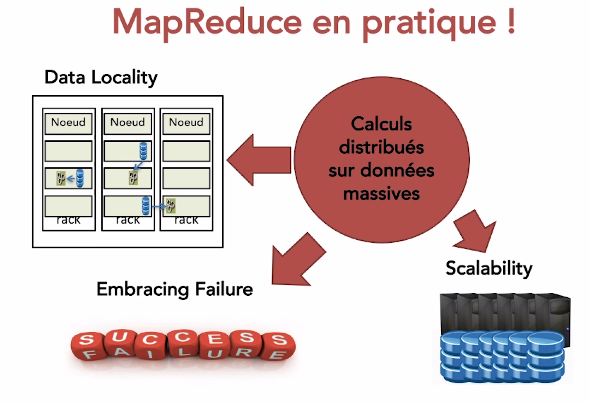

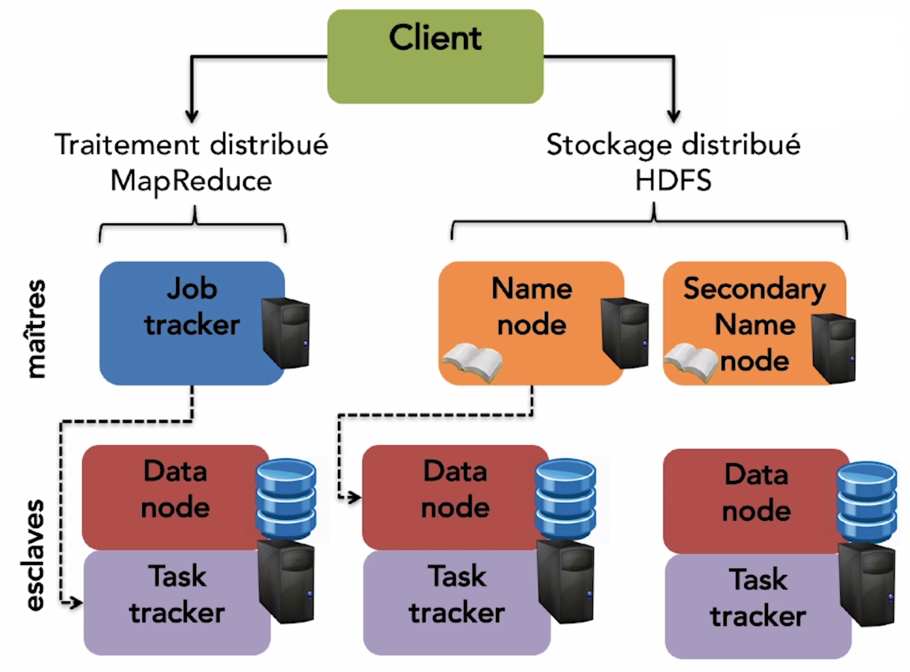

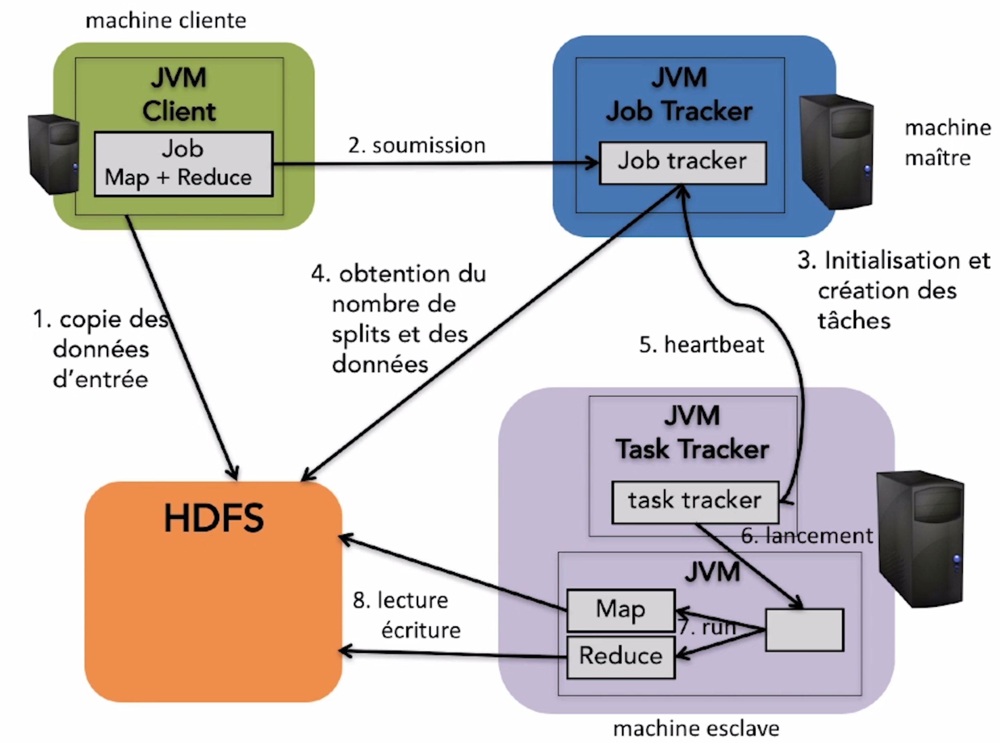

### WordCount

On lance le docker dans le dossier docker-hadoop et on se rend en bash sur le namenode.

on va travailler dans le dossier wordCountJava dans le repertoire user.

NB. : nano et wget ne sont pas installés, mais tout le monde sait le faire. ;-)

Dans le fichier `WordCountMapper.java` :

	package rait.bigdata.wordcount;
	
	import java.io.IOException;
	import java.util.StringTokenizer;
	import org.apache.hadoop.io.IntWritable;
	import org.apache.hadoop.io.LongWritable;
	import org.apache.hadoop.io.Text;
	import org.apache.hadoop.mapreduce.Mapper;
	
	public class WordCountMapper extends Mapper<LongWritable, Text, Text, IntWritable> {
	
	    private final static IntWritable one = new IntWritable(1);
	    private Text word = new Text();
	
	    @Override
	    public void map(LongWritable key, Text value, Context context) throws IOException, InterruptedException {
	        String line = value.toString();
	
	        StringTokenizer tokenizer = new StringTokenizer(line);
	        while (tokenizer.hasMoreTokens()) {
	            word.set(tokenizer.nextToken());
	            context.write(word, one);
	        }
	    }
	
	    public void run(Context context) throws IOException, InterruptedException {
	        setup(context);
	        while (context.nextKeyValue()) {
	            map(context.getCurrentKey(), context.getCurrentValue(), context);
	        }
	        cleanup(context);
	    }
	
	}

Dans le fichier `WordCountReducer.java` :

	package rait.bigdata.wordcount;
	
	import java.io.IOException;
	import java.util.Iterator;
	
	import org.apache.hadoop.io.IntWritable;
	import org.apache.hadoop.io.Text;
	import org.apache.hadoop.mapreduce.Reducer;
	
	public class WordCountReducer extends Reducer<Text, IntWritable, Text, IntWritable> {
	
	    private IntWritable totalWordCount = new IntWritable();
	
	    @Override
	    public void reduce(final Text key, final Iterable<IntWritable> values,
	            final Context context) throws IOException, InterruptedException {
	
	        int sum = 0;
	        Iterator<IntWritable> iterator = values.iterator();
	
	        while (iterator.hasNext()) {
	            sum += iterator.next().get();
	        }
	
	        totalWordCount.set(sum);
	        // context.write(key, new IntWritable(sum));
	        context.write(key, totalWordCount);
	    }
	}
	
Dans le fichier `WordCountDriver.java` :

	package rait.bigdata.wordcount;
	
	import org.apache.hadoop.conf.Configuration;
	import org.apache.hadoop.conf.Configured;
	import org.apache.hadoop.fs.FileSystem;
	import org.apache.hadoop.fs.Path;
	import org.apache.hadoop.io.IntWritable;
	import org.apache.hadoop.io.Text;
	import org.apache.hadoop.mapreduce.Job;
	import org.apache.hadoop.mapreduce.lib.input.FileInputFormat;
	import org.apache.hadoop.mapreduce.lib.input.TextInputFormat;
	import org.apache.hadoop.mapreduce.lib.output.FileOutputFormat;
	import org.apache.hadoop.mapreduce.lib.output.TextOutputFormat;
	import org.apache.hadoop.util.GenericOptionsParser;
	import org.apache.hadoop.util.Tool;
	import org.apache.hadoop.util.ToolRunner;
	
	public class WordCountDriver extends Configured implements Tool {
	    public int run(String[] args) throws Exception {
	        if (args.length != 2) {
	            System.out.println("Usage: [input] [output]");
	            System.exit(-1);
	        }
	        // Creation d'un job en lui fournissant la configuration et une description textuelle de la tache
	        Job job = Job.getInstance(getConf());
	        job.setJobName("wordcount");
	
	        // On precise les classes MyProgram, Map et Reduce
	        job.setJarByClass(WordCountDriver.class);
	        job.setMapperClass(WordCountMapper.class);
	        job.setReducerClass(WordCountReducer.class);
	
	        // Definition des types cle/valeur de notre probleme
	        job.setOutputKeyClass(Text.class);
	        job.setOutputValueClass(IntWritable.class);
	
	        job.setInputFormatClass(TextInputFormat.class);
	        job.setOutputFormatClass(TextOutputFormat.class);
	
	        Path inputFilePath = new Path(args[0]);
	        Path outputFilePath = new Path(args[1]);
	
	        // On accepte une entree recursive
	        FileInputFormat.setInputDirRecursive(job, true);
	
	        FileInputFormat.addInputPath(job, inputFilePath);
	        FileOutputFormat.setOutputPath(job, outputFilePath);
	
	        FileSystem fs = FileSystem.newInstance(getConf());
	
	        if (fs.exists(outputFilePath)) {
	            fs.delete(outputFilePath, true);
	        }
	
	        return job.waitForCompletion(true) ? 0: 1;
	    }
	
	    public static void main(String[] args) throws Exception {
	        WordCountDriver wordcountDriver = new WordCountDriver();
	        int res = ToolRunner.run(wordcountDriver, args);
	        System.exit(res);
	    }
	}
	
On va compiler notre java 

	which hadoop
	export HADOOP_HOME=/opt/hadoop-2.7.1
	export HADOOP_CLASSPATH=$($HADOOP_HOME/bin/hadoop classpath)
	javac -classpath $HADOOP_CLASSPATH WordCount*.java
	
On créer le jar :

	mkdir -p rait/bigdata/wordcount
	mv *.class rait/bigdata/wordcount
	jar -cvf rait_bigdata_wordcount.jar -C . rait

On va ajouter dans HDFS le fichier qu'on va traiter :

	wget http://www.textfiles.com/ufo/airspace.txt
	hdfs dfs -mkdir /input
	hdfs dfs -copyFromLocal airspace.txt /input

On éxécute ensuite avec 

	hadoop jar rait_bigdata_wordcount.jar rait.bigdata.wordcount.WordCountDriver /input/airspace.txt /results
	
Le résultat est aussi stocké dans HDFS.

	hdfs dfs -ls /results
	hdfs dfs -cat /results/part-r-00000

### Wordcount Python

Et la même chose en python ??

#### Hadoop streaming

Java n'est pas du tout votre langage préféré et vous vous dites que, pour déployer votre algorithme MapReduce sur Hadoop vous n'allez pas pouvoir y échapper ? Et bien, bonne nouvelle, il y a Hadoop Streaming. C'est un outil distribué avec Hadoop qui permet l'exécution d'un programme écrit dans d'autres langages, comme par exemple Python, C, C++...

En fait, Hadoop Streaming est un.jar qui prend en arguments :

des programmes ou scripts définissant les tâches MAP et REDUCE (dans n'importe quel langage),

les fichiers d'entrée et le répertoire de sortie HDFS.

##### Hadoop Streaming - MAP

Pour écrire un programme MAP pour Hadoop mais dans un autre langage, il faut que les données d'entrée soient lues sur l'entrée standard (stdin) et les données de sorties doivent être envoyées sur la sortie standard (stdout). On écrira donc notre série de paires(clé, valeur), chaque paire sur une ligne différente, au format :

	Clé[TABULATION]Valeur

##### Hadoop Streaming - REDUCE

Le même mécanisme doit être mis en place pour le programme REDUCE. Nous avons en entrée et en sortie du programme une série de lignes au format

	Clé[TABULATION]Valeur
	
##### Exécution

Une fois écrits vos programmes MAP et REDUCE avec votre langage préféré, il suffit alors d'exécuter votre application de la manière suivante :

	hadoop jar hadoop-streaming.jar -input [fichier entree HDFS] \
	                                  -output [fichier sortie HDFS] \
	                                  -mapper [programme MAP] \
	                                  -reducer [programme REDUCE]

#### Allons-y !!

On se créé un nouveau repertoire pour l'occasion à la racine de notre compte utilisateur. Appelons le wcPython.

Dans ce repertoire, on créé `WordCountMapper.py`

	#! /usr/bin/env python3
	import sys
	
	for line in sys.stdin:
	    # Supprimer les espaces
	    line = line.strip()
	    # recupérer les mots
	    words = line.split()
	
	    # operation map, pour chaque mot, generer la paire (mot, 1)
	    for word in words:
	        print("%s\t%d" % (word, 1))

Puis `WordCountReducer.py` :

	#! /usr/bin/env python3

	import sys
	total = 0
	lastword = None
	
	for line in sys.stdin:
	    line = line.strip()
	
	    # recuperer la cle et la valeur et conversion de la valeur en int
	    word, count = line.split()
	    count = int(count)
	
	    # passage au mot suivant (plusieurs cles possibles pour une même exécution de programme)
	    if lastword is None:
	        lastword = word
	    if word == lastword:
	        total += count
	    else:
	        print("%s\t%d occurences" % (lastword, total))
	        total = count
	        lastword = word
	        
	if lastword is not None:
	    print("%s\t%d occurences" % (lastword, total))

On peut executer ensuite la fonction mapReduce avec la commande 
	
	hadoop jar /opt/hadoop-2.7.1/share/hadoop/tools/lib/hadoop-streaming-2.7.1.jar -input /input/airspace.txt -output /resultsPyhton -mapper ./WordCountMapper.py -reducer ./WordCountReducer.py

[https://bitbucket.org/uhopper/hadoop-docker](https://bitbucket.org/uhopper/hadoop-docker)

### Les exemples Hadoop

[https://github.com/apache/hadoop/tree/trunk/hadoop-mapreduce-project/hadoop-mapreduce-examples/src](https://github.com/apache/hadoop/tree/trunk/hadoop-mapreduce-project/hadoop-mapreduce-examples/src)

Chacun en prend un, et explique sur Slack :

1. Le but de la fonction
2. Les couple clef => valeur retenus
3. La fonction map
4. La fonction Reduce

Exemple wordcount avec HDFS (à sauter): [https://hadoop.apache.org/docs/stable/hadoop-mapreduce-client/hadoop-mapreduce-client-core/MapReduceTutorial.html](https://hadoop.apache.org/docs/stable/hadoop-mapreduce-client/hadoop-mapreduce-client-core/MapReduceTutorial.html)

#### Exercice MapReduce sur données boutiques

Il y a dans le repository un csv `SalesJan2009.csv`. Dans ce csv, chaque ligne représente une vente de produits.

Information: en Java pour découper une ligne de csv séparé par des virgule, on utilise la fonction de la classe string : valueString.split(",");

La question à répondre avec MapReduce est : combien de produit ont été vendu par pays ?

Solution :
[https://www.guru99.com/create-your-first-hadoop-program.html](https://www.guru99.com/create-your-first-hadoop-program.html)

### Hadoop Map Reduce Exercice à faire

La première étape est donc de récupérer ces deux documents (http://www.textfiles.com/etext/FICTION/defoe-robinson-103.txt et http://www.textfiles.com/etext/FICTION/callwild) et de les stocker dans HDFS dans un repertoire `/exercice/input`. 

#### TF-IDF

Si vous n'avez jamais entendu parler de la pondération TF-IDF, alors je vous invite à lire la page Wikipedia qui la présente. Dans cette activité, nous prendrons la formule suivante :

	w_t,d = (tf_t,d / n_d) × log(N/df_t)

avec :

tf_t,d qui représente la fréquence d'un mot t dans un document d. Tiens... cela ne vous rappelle rien ?
n_d qui représente le nombre de mots dans un document d (on pourra l'appeler WordPerDoc).
df_t qui représente la fréquence du terme dans la collection, soit le nombre de documents dans lequel le mot t est présent (dans notre cas, ce sera 1 ou 2).
Enfin N est le nombre de documents dans notre collection, soit ici 2.
Pour répondre à ce problème en MapReduce, l'approche la plus simple est de décomposer le calcul en 3 tâches :

**1-** Le calcul du nombre d'occurrences des mots dans un document, soit WordCount ! On prendra comme clé pour MAP et REDUCE la paire (mot, doc_ID) où doc_ID est l'identifiant du document. Pour réduire le travail des nœuds REDUCE, la suite de traitements suivante sera appliquée :

* Mise en minuscule.
* Filtrage des mots inutiles à l'aide de cette liste de stop words.
* Suppression des ponctuations et des caractères numériques (par exemple à l'aide d'expressions régulières).
* Suppression des mots de moins de 3 caractères.

**2-** Le calcul du nombre total de mots dans chaque document que nous appellerons WordPerDoc. Pour cette tâche, l'entrée sera donc la sortie de la tâche précédente. On doit avoir en sortie de cette tâche un ensemble de paires ((mot, doc_ID), (wordcount, wordperdoc)).

**3-** Enfin, la dernière tâche est finalement le calcul du TF-IDF lui-même. Elle prend en entrée la sortie de la tâche 2 et nous aurons en sortie un ensemble de paires ((mot, doc_ID), TF-IDF)

### Hadoop et temps réel

On va utiliser des produits préinstallé dans les principales distribution d'Hadoop (cloudera et HortonWorks)

#### Un cas

Nous sommes Youhou et on un site web

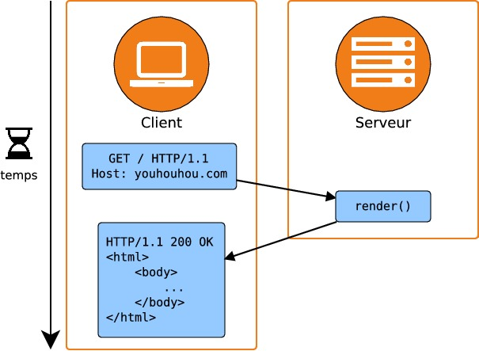

Le site web augment son traffic et on veut ajouter une fonctionnalité de log et d'alerting mail. Ca devient potentiellement long :

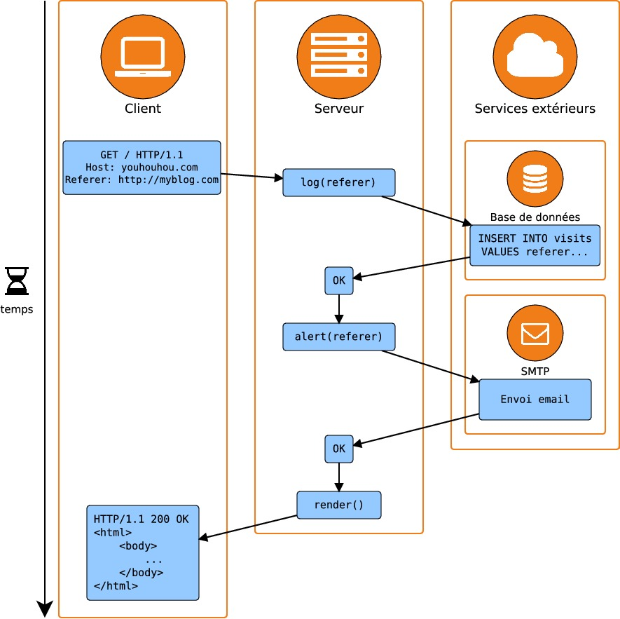

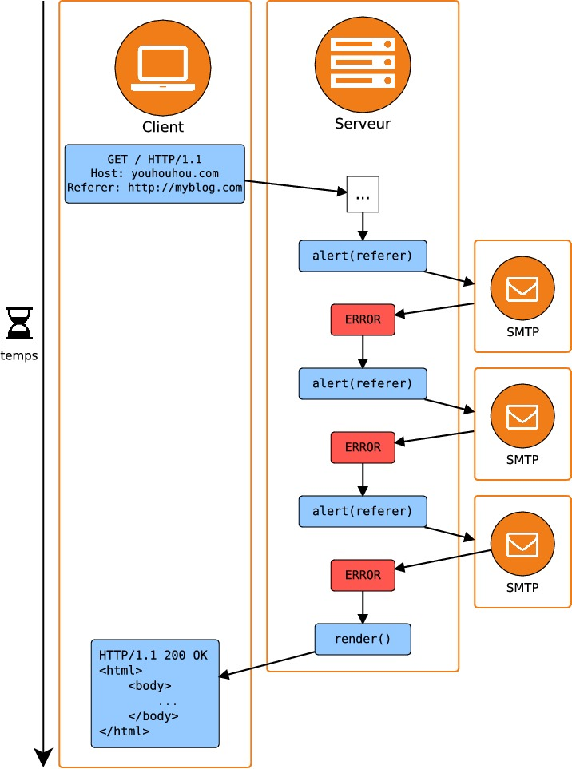

#### La solution

On va mettre en place un système de queue

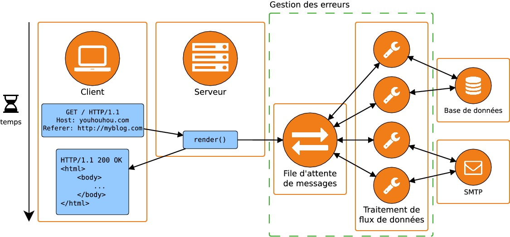

On va utiliser Apache KAFKA et Apache Storm (les deux font partie des distribs HortonWorks).

#### Un autre cas, agrégation de logs

Un problème qui émerge systématiquement dans les applications distribuées est celui de l'agrégation des logs. Une application distribuée sur plusieurs serveurs génère des logs sur chacun de ces serveurs : cela signifie que pour déboguer une application distribuée, il faut examiner les logs présents sur chacun des serveurs indépendamment. Ceci peut rendre le débogage très compliqué, voire impossible à partir de plusieurs dizaines de serveurs. C'est typiquement ce qui peut se produire dans une application web dont les différents serveurs sont accessibles derrière un répartiteur de charge ("load balancer").

Pour résoudre ce problème, la première étape consiste à agréger les logs sur un seul serveur. Il existe différents outils pour réaliser cela, mais on peut tout à fait envisager de les remplacer par une file d'attente de messages. L'avantage, c'est qu'une telle file permet non seulement d'agréger des logs, mais également de les transmettre à un système de traitement de flux pour analyse. Une application classique est la détection des erreurs et l'envoi d'alertes : lorsqu'une exception est levée dans une application, la stacktrace de l'erreur est transmise par e-mail à l'équipe technique.

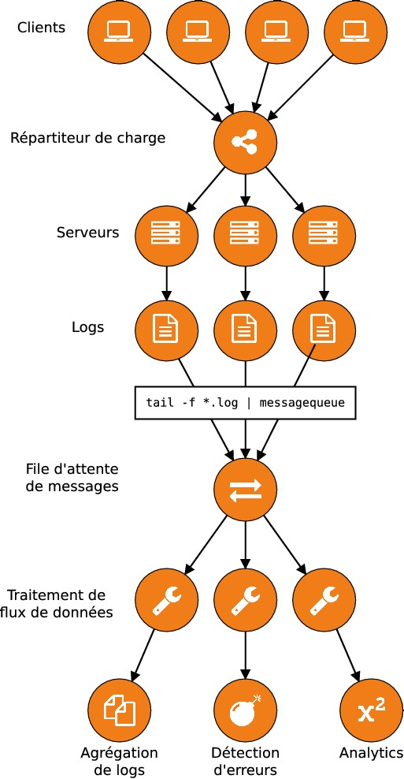

#### Un dernier cas, déclenchement de tâches asynchrones

Certaines tâches ne doivent pas être réalisées de manière synchrone : soit parce qu'elles ne concernent pas l'utilisateur, soit parce qu'il faudrait faire patienter l'utilisateur trop longtemps avant qu'elles ne finissent de s'exécuter. C'est ce que nous avons vu dans le chapitre précédent avec l'envoi d'e-mails. Une fois qu'une file de messages et un système de traitement de flux ont été mis en place, il est possible d'exécuter un grand nombre de tâches en parallèle qui permettront d'extraire énormément de valeur des données générées sans affecter les performances de l'application principale. C'est par exemple ce qui est fait dans les plateformes d'hébergement de vidéos qui doivent mettre en place des tâches de transcodage des fichiers uploadés par les utilisateurs pour obtenir des vidéos en différentes résolutions.

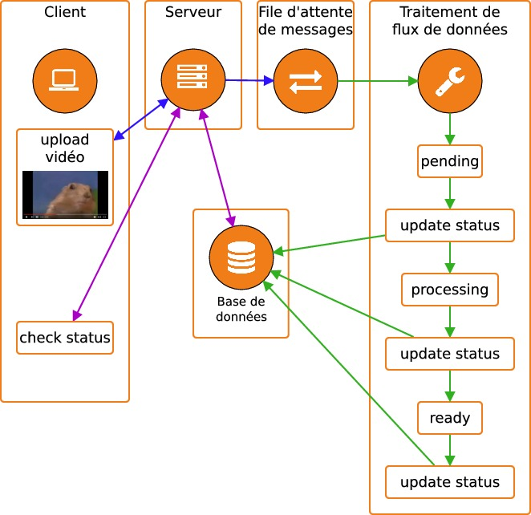

Dans ce schéma, les utilisateurs réalisent des requêtes périodiques sur le serveur pour obtenir des informations sur la progression du transcodage. Notez le rôle prépondérant de la base de données qui permet au serveur frontal de communiquer avec le système de traitement des données. Cette communication se fait de manière indirecte, puisque le traitement des données se fait dans un process séparé de celui du serveur.

#### Apache KAFKA

Kafka est bien plus qu'une file de messages et peut être utilisé comme une plateforme complète d'échanges de données. En pratique, cela signifie que Kafka peut agir comme une plateforme distribuée qui centralise tous les messages qui transitent entre différentes applications. Documentation officielle : [https://kafka.apache.org/documentation/](https://kafka.apache.org/documentation/)

Il y a une image Docker de prète dans le repertoire docker-kafka. On la lance avec 

	docker-compose up -d

Pour exécuter Kafka, nous avons besoin de lancer deux composants :

* Zookeeper, qui est le gestionnaire de cluster de Kafka.
* Un serveur Kafka que l'on nommera broker.

Zookeeper n'est pas notre file de messages, mais c'est un composant essentiel pour que Kafka fonctionne : en tant que gestionnaire de cluster, c'est Zookeeper qui est en charge de réaliser la synchronisation des différents éléments d'un cluster. Dans un cluster composé de plusieurs machines, les différents services passent par Zookeeper pour échanger des données et stocker leur configuration; Zookeeper permet également la découverte de services. Vous n'aurez pas à savoir grand-chose de plus sur Zookeeper, mais vous êtes encouragés à consulter la documentation officielle ainsi que le wiki pour en apprendre plus. [https://zookeeper.apache.org/doc/trunk/](https://zookeeper.apache.org/doc/trunk/) [https://cwiki.apache.org/confluence/display/ZOOKEEPER/Index](https://cwiki.apache.org/confluence/display/ZOOKEEPER/Index)

On se connecte en shell au container qui fait tourner Kafka :

	docker exec -it kafka bash
	
Dans ce container on va créer un topic de test :

	cd /opt/kafka_2.11-0.10.1.0
	./bin/kafka-topics.sh --create --zookeeper localhost:2181 --replication-factor 1 --partitions 1 --topic blabla
	
On peut lister les topics avec la commande :
	
	./bin/kafka-topics.sh --list --zookeeper localhost:2181
	./bin/kafka-topics.sh --list --zookeeper localhost:2181 --describe
	
Dans kafka, on produit les messages avec des producers et on les consomme avec des consummers.

	./bin/kafka-console-producer.sh --broker-list localhost:9092 --topic blabla

On les lit avec le consummer :

	./bin/kafka-console-consumer.sh --bootstrap-server localhost:9092 --topic blabla
	
Après avoir lancé le producer et le consumer, essayez de taper quelques messages dans l'entrée standard du **producer**. Ces messages devraient apparaître dans la sortie du **consumer**.

Observez-vous une petite latence entre le moment où vous envoyez le message et le moment où il est reçu par le consumer ? Ceci est dû au fait que, par défaut, le producer envoie les messages par lots de 200 avec une latence maximale de 1000 ms. Pour modifier ce comportement du producer, utilisez l'option--batch-size=1ou--timeout=0.

Ici on reste sur du fonctionnement âr défaut, les messages sont stocké 168h (7jours) avant d'être effacées.

	./bin/kafka-console-consumer.sh --bootstrap-server localhost:9092 --from-beginning --topic blabla

Mais le fonctionnement attendu, pour nous, est de relever un message et de ne le traiter qu'une fois. Pour faire cela on utilise un **groupe** pour le consummer.

	./bin/kafka-console-consumer.sh --bootstrap-server localhost:9092 --topic blabla --consumer-property group.id=mygroup

On peut avoir les listes et info des groupes avec les commandes

	./bin/kafka-consumer-groups.sh --bootstrap-server localhost:9092 --list
	./bin/kafka-consumer-groups.sh --bootstrap-server localhost:9092 --describe --group mygroup
	
Les groupes vont nous permettre de passer à l'echelle en mutlipliant les consummers. Si on lance un second consummer sur le même groupe, on constate que seul le premier récupère les messages. Vous le voyez aussi ?

C'est pour notre bien, Kafka fait ça pour nous garantir le traitement des messages dans l'ordre. On ne peut pas avoir plus de consummers que de partitions (et notre producers n'a qu'une partition).

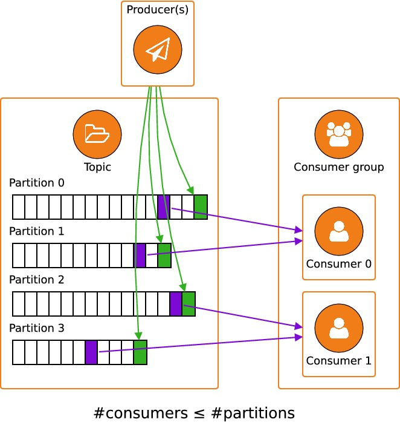

Une partition est une manière de distribuer les données d'un même topic. Lors de la création d'un topic, on indique le nombre de partitions souhaité, comme on l'a vu plus haut avec l'option--partitionspassée à la commandekafka-topics.sh --create.

Un topic peut être composé de plusieurs partitions. Chacune de ces partitions contient des messages différents. Lorsqu'un producer émet un message, c'est à lui de décider à quelle partition il l'ajoute. Ce choix d'une partition peut se faire de différentes manières, dont voici quelques exemples (non exhaustifs) :

* Aléatoirement : pour chaque message, une partition est choisie au hasard. C'est ce qui est fait par notrekafka-console-producer.
* Round robin : le producer itére sur les partitions les unes après les autres pour distribuer un nombre de message égal sur chaque partition.
* Hashage : le producer peut choisir une partition en fonction du contenu du message. C'est une fonctionnalité que nous verrons dans le chapitre suivant.

Chaque partition est une FIFO. kafka conserve conserve en mémoire l'emplacement du curseur de lecture de chaque partitions.

C'est les consumers qui vont demander à kafka de faire évoluer ce curseur dans chaque partition.

On va modifier notre topic pour augmenter le nombre de partitions 

	./bin/kafka-topics.sh --alter --zookeeper localhost:2181 --topic blabla --partitions 2
	
C'est mieux ? Refaites le test.

##### On dev avec Kafka

Allez créer un compte sur 

	https://developer.jcdecaux.com
	
On va avoir besoin d'une clef d'API. Quand vous l'avez, on test, sur le container python :

	curl https://api.jcdecaux.com/vls/v1/stations?apiKey=XXX
	curl https://api.jcdecaux.com/vls/v1/stations?apiKey=XXX | python -m json.tool
	
Notre but va être de mettre en place une application qui va nous afficher les évolutions des places de velib sous cette forme.

	+1 MAZARGUES - ROND POINT DE MAZARGUES (OBELISQUE) (Marseille)
	+14 Lower River Tce / Ellis St (Brisbane)
	+2 2 RUE GATIEN ARNOULT (Toulouse)
	+20 ANGLE ALEE ANDRE MURE ET QUAI ANTOINE RIBOUD (Lyon)
	+14 Smithfield North (Dublin)
	+28 52 RUE D'ENGHIEN / ANGLE RUE DU FAUBOURG POISSONIERE - 75010 PARIS (Paris)
	+6 RUE DES LILAS ANGLE BOULEVARD DU PORT - 95000 CERGY (Cergy-Pontoise)
	+6 San Juan Bosco - Santiago Rusiñol (Valence)
	+21 AVENIDA REINA MERCEDES - Aprox. Facultad de Informática (Seville)
	+6 Savska cesta 1 (Ljubljana)
	+31 DE BROUCKERE - PLACE DE BROUCKERE/DE BROUCKEREPLEIN (Bruxelles-Capitale)
	+7 BRICHERHAFF - AVENUE JF KENNEDY / RUE ALPHONSE WEICKER (Luxembourg)
	...

###### Producer

On créé un repertoire kafkaPython et dans `velib-get-stations.py` :

	import json
	
	import time
	
	import urllib.request
	
	
	from kafka import KafkaProducer
	API_KEY = "XXX" # FIXME Set your own API key here	
	url = "https://api.jcdecaux.com/vls/v1/stations?apiKey={}".format(API_KEY)
	
	producer = KafkaProducer(bootstrap_servers="kafka:9092")
	
	while True:
	    response = urllib.request.urlopen(url)
	    stations = json.loads(response.read().decode())
	    for station in stations:
	        producer.send("velib-stations", json.dumps(station).encode())
	    print("{} Produced {} station records".format(time.time(), len(stations)))
	    time.sleep(1)
	    
Coté Kafka, il faut créer le topic qui va accueillir les messages :

	./bin/zookeeper-server-start.sh ./config/zookeeper.properties
	./bin/kafka-server-start.sh ./config/server.properties
	./bin/kafka-topics.sh --create --zookeeper localhost:2181 --replication-factor 1 --partitions 1 --topic velib-stations

###### Consummer

On créé le consummer `velib-monitor-stations.py`

	import json
	from kafka import KafkaConsumer
	
	stations = {}
	consumer = KafkaConsumer("velib-stations", bootstrap_servers='localhost:9092', group_id="velib-monitor-stations")
	for message in consumer:
	    station = json.loads(message.value.decode())
	    station_number = station["number"]
	    contract = station["contract_name"]
	    available_bike_stands = station["available_bike_stands"]
	
	    if contract not in stations:
	        stations[contract] = {}
	    city_stations = stations[contract]
	    if station_number not in city_stations:
	        city_stations[station_number] = available_bike_stands
	
	    count_diff = available_bike_stands - city_stations[station_number]
	    if count_diff != 0:
	        city_stations[station_number] = available_bike_stands
	        print("{}{} {} ({})".format(
	            "+" if count_diff > 0 else "",
	            count_diff, station["address"], contract
	        ))

Ici on a créé le consummer. On pourrait maintenant ajouter un nouveau producer dans ce consumer pour chainer avec un autre consumer pour envoyer des mails par exemple.

Pour le moment, on est pas scalable

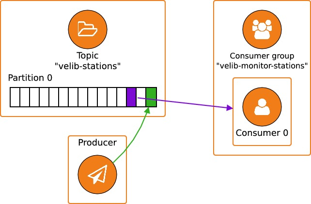

Si on veut multiplier les consummers pour passer à l'echelle :

	./bin/kafka-topics.sh --alter --zookeeper localhost:2181 --topic velib-stations --partitions 10
	
On peut maintenant lancé un nouveau consummer.

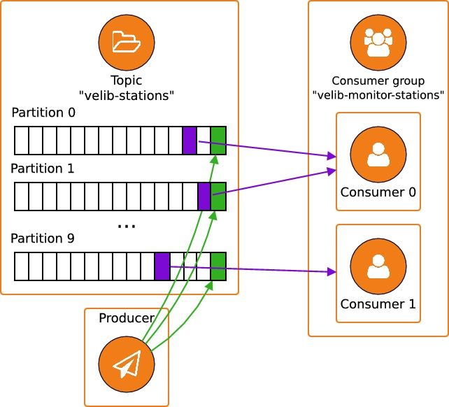

###### Optimisation du fonctionnement

Il serait interessant que tous les messages d'une station soit stockées dans une même partition.

	producer.send(..., key=str(station["number"]).encode())
	
On utilise une fonction pour envoyer les messages à la même queue pour la même station

Le fichier `velib-get-stations.py` devient :

	#! /usr/bin/env python3
	import json
	import time
	import urllib.request
	
	# Run `pip install kafka-python` to install this package
	from kafka import KafkaProducer
	
	API_KEY = "XXX" # FIXME
	url = "https://api.jcdecaux.com/vls/v1/stations?apiKey={}".format(API_KEY)
	
	producer = KafkaProducer(bootstrap_servers="localhost:9092")
	
	while True:
	    response = urllib.request.urlopen(url)
	    stations = json.loads(response.read().decode())
	    for station in stations:
	        producer.send("velib-stations", json.dumps(station).encode(),
	                      key=str(station["number"]).encode())
	    print("Produced {} station records".format(len(stations)))
	    time.sleep(1)
	    
Une autre optimisation va être de changer le règlage de la rentention. par exemple en demandant de supprimer les datas toutes les 4 secondes.
	
	./bin/kafka-configs.sh --zookeeper localhost:2181 --entity-type topics --entity-name velib-stations --alter --add-config retention.ms=4000
	
En modifiant le paramètreretention.ms, on demande à Kafka d'effacer un segment de données toutes les quatre secondes. Un segment est une succession de messages dans une partition. Par défaut, un nouveau segment est créé chaque semaine, et dès que la quantité de messages dépasse 1 Go. Pour que la nouvelle valeur du paramètreretention.mssoit effective, il faut donc diminuer la longueur maximale d'un segment :

	./bin/kafka-configs.sh --zookeeper localhost:2181 --entity-type topics --entity-name velib-stations --alter --add-config segment.ms=2000
	
On est au top.

##### Exercice Kafka

Dans cette activité, vous allez tout d'abord créer un topic empty-stations dans votre cluster Kafka. Puis, vous allez modifier le script `get-stations.py`

	#! /usr/bin/env python3
	import json
	import time
	import urllib.request
	
	# Run `pip install kafka-python` to install this package
	from kafka import KafkaProducer
	
	API_KEY = "XXX" # FIXME
	url = "https://api.jcdecaux.com/vls/v1/stations?apiKey={}".format(API_KEY)
	
	producer = KafkaProducer(bootstrap_servers="localhost:9092")
	
	while True:
	    response = urllib.request.urlopen(url)
	    stations = json.loads(response.read().decode())
	    for station in stations:
	        producer.send("velib-stations", json.dumps(station).encode(),
	                      key=str(station["number"]).encode())
	    print("Produced {} station records".format(len(stations)))
	    time.sleep(1)

 pour :

1. émettre un message dans le topic empty-stations dès qu'une station devient vide (alors qu'elle n'était pas vide auparavant).
2. émettre un message dans le topic empty-stations dès qu'une station n'est plus vide (alors qu'elle était vide auparavant).

Enfin, vous allez écrire un script monitor-empty-stations.py qui va afficher dans la console un message dès qu'une station devient vide (alors qu'elle n'était pas vide auparavant). Ce message devra contenir :

1. l'adresse de la station,
2. la ville de la station,
3. le nombre de stations vides dans la ville.

Vous veillerez à ce que le nombre de stations vides affiché par le script monitor-empty-stations.py soit correct même lorsque le topic empty-stations aura plusieurs partitions.

Attention ! Il peut y avoir des stations avec des identifiants identiques dans des villes différentes.

#### Apache Storm

