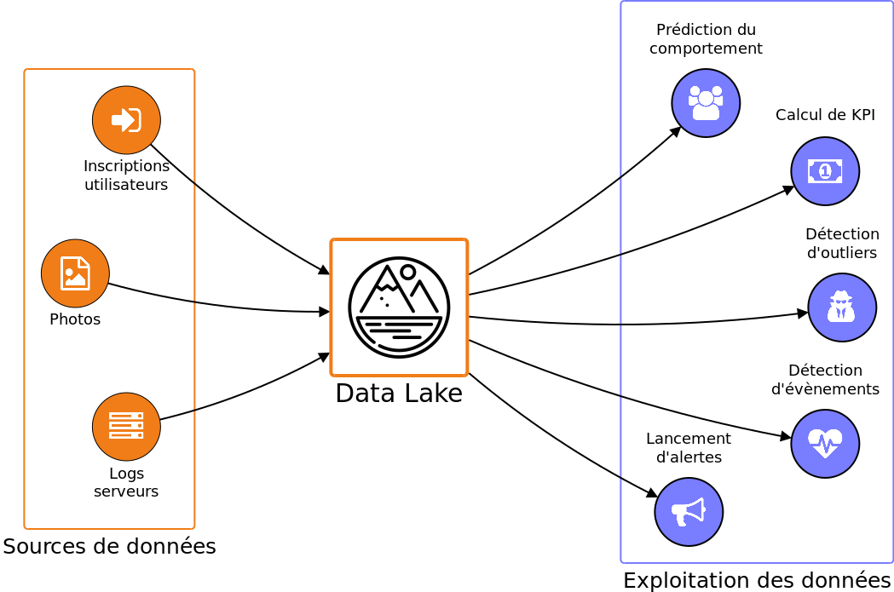

# HADOOP

## Mise en place de l'environnement

Dans le repertoire docker-hadoop, il y a un fichier docker-compose.yml que nous allons analyser ensemble et qui va permettre d'initialiser un cluster Hadoop sur nos machines.

Pour le lancer, `docker-compose up -d`

## Pratique du HDFS

### Créons notre datalake

TODO: Réécrire cette partie

Commençons par définir ce dont nous avons besoin : nous allons stocker une grande quantité de données dans un dépôt qui va être la source d'information principale, voire unique, d'un certain nombre d'applications. Dans le jargon du Big Data, un tel dépôt est appelé un Data Lake.

De l'autre côté, comment se comporteront les applications qui utilisent le master dataset ? On peut imaginer qu'elles vont lire les données au fur et à mesure qu'elles leurs parviennent, sans chercher à revenir en arrière aléatoirement. Autrement dit : les applications vont réaliser des opérations de lecture séquentielles. Par exemple, pour calculer le nombre moyen d'inscriptions par jour, une application va lire toutes les données d'une même journée dans l'ordre. Elle ne va pas avoir besoin de faire des opérations de lecture en accès aléatoire dans le master dataset.

On peut déduire de ces observations nos premiers besoins concernant le master dataset :

    Les données ne seront écrites une seule fois (Write once)

    Le master dataset ne subira que des ajouts (Append-only)

    Le master dataset sera lu de nombreuses fois (Read many times)

    Les opérations de lecture seront séquentielles (Sequential reads)

Ces besoins dessinent les contours d'une ébauche de solution pour ce qui est du stockage des donnés. Rajoutons une contrainte forte : comme le master dataset est voué à croître strictement avec le temps, il faut que la solution de stockage soit peu coûteuse. Par ailleurs, il faut que la solution retenue passe à l'échelle : il faut donc que le stockage se fasse de manière distribuée sur plusieurs machines. Mais de quelle augmentation de donnés parle-t-on au juste ? Prenons l'exemple de trois applications plus ou moins populaires qui génèrent entre 1 et 100 Go de données chaque jour :

* 1 Go/jour => 11.5 ko/s => 365 Go/an
* 10 Go/jour => 115 ko/s => 3.65 To/an
* 100 Go/jour => 1.15 Mo/s => 36.5 To/an

L'augmentation annuelle de données peut être relativement conséquente (36.5 To/an) ; par contre, le débit moyen ramené à l'échelle de la seconde est assez faible (1.15 Mo/s). Cela signifie que la solution de stockage que nous allons choisir ne devra pas nécessairement offrir une vitesse d'écriture élevée. C'est pas mal, ça nous facilite la tâche.

Pour ce qui est de la présentation des données : comme on l'a déjà mentionné, on a besoin qu'elles soient exploitables par un grand nombre d'applications différentes, éventuellement rédigée dans des langages de programmation différents. Par ailleurs, l'organisation des données risque d'évoluer avec le temps et les besoins. Comme on ne permet pas que les données de notre master dataset soient modifiées, il faut que la solution utilisée pour structurer les données dispose d'une organisation évolutive de manière native.

#### Quelle méthode va-t'on utiliser ?

##### Base de données Relationnelles (RDBMS) ?

Non : 

* couteuses
* pas adaptées pour des donées au format arbitraire
* suporteront mal l'évolution du format de données

Les RDBMS seront plus adapté aux besoins d'update de données, aux accès aléatoire et à l'algèbre relationnel bien sur.

##### Stocker des fichiers textes ?

Par exemple des fichiers semi structurés JSON ou XML. C'est simple, consomme peu de disque si on les compresse. Par contre peu d'évolution possible sur le format de donnnées.

Par exemple en JSON un nouvel utilisateur :

	{
	    "username": "alice"
	}

Plus tard on décide d'ajouter la date de naissance :

	{
	    "username": "ada",
	    "year_birth": 1815
	}
	
On va avoir une partie des fichiers avec un username, d'autres avec un username et une date de naissance. Il faudra que toutes les applications qui utiliseront ce dataset gère la présence ou l'absence de chaque données. Ce n'est clairement pas la bonne solution.

##### Un système de fichier distribué ?

Oui on va utiliser HDFS.

#### HDFS en ligne de commande

Pour commencer, nous allons manipuler hdfs en ligne de commande.

Les commandes vont prendre la forme de 

	hdfs dfs -<nom de la commande> [options] <arguments>
	
par exemple pour lister le contenu à la racine :

	hdfs dfs -ls /

La documentation de toute les commandes sur le site officiel [https://hadoop.apache.org/docs/current/hadoop-project-dist/hadoop-common/FileSystemShell.html]()

	hdfs dfs -mkdir /testCommandLine
	hdfs dfs -ls /
	hdfs dfs -touchz /testCommandLine/test.txt
	hdfs dfs -ls /testCommandLine
	
	apt-get update
	apt-get install nano -y
	
	nano testLocal.txt
	
	hdfs dfs -appendToFile testLocal.txt /testCommandLine/test.txt
	hdfs dfs -cat /testCommandLine/test.txt
	hdfs fsck /testCommandLine/test.txt -files -locations -blocks
	
	hdfs dfsadmin -allowSnapshot /testCommandLine
	hdfs dfs -createSnapshot /testCommandLine snapshot1
	hdfs dfs -touchz /testCommandLine/nouveaufichier.txt
	hdfs snapshotDiff /testCommandLine snapshot1 .
	hdfs dfs -cp -f /testCommandLine/.snapshot/snapshot1/* /testCommandLine/
	hdfs dfs -createSnapshot /testCommandLine
	
On peut accèder à l'interface d'administration du cluster via un navigateur, on y retrouvera entre autre nos snapshots :

	http://localhost:50070

##### A votre tour

Dans le name node, en ligne de commande. 

* Créer en local un fichier texte avec quelques lignes dedans
* Créer un nouveau repertoire à la racine du cluster
* Envoyer votre fichier (commande copyFromLocal) sur HDFS dans votre nouveau repertoire
* Créer un autre fichier vide dans votre repertoire hdfs
* Remplissez ce fichier avec deux fois le contenu de votre fichier texte local
* Créer un repertoire nommé backup dans le reperoire hdfs où se trouve vos fichier
* Copier tous les fichiers dans backup (commande cp)
* Lister le contenu de vos repertoires
* Récupérer en local les contenus des vos fichiers.
* Supprimer tout ce que vous venez de créer sur hdfs
* Quitter maintenant le container namenode
	
#### HDFS avec python

Rendez-vous dans le container python :

	docker exec -it docker-hadoop_python_1 bash

On va commencer par créer un fichier de connexion à HDFS en python nano `testHdfs.py` :

	import hdfs
	client = hdfs.InsecureClient("http://namenode:50070")
	
	# Affichage des données à la racine
	# l'appel à "list()" renvoie une liste de noms de fichiers et de répertoires
	client.list("/")
	
	with client.write("/pouac.txt", overwrite=True) as writer:
	     # notez que l'appel à "write()" prend en arguments un bytes et non un str
	    writer.write(b"plonk")
	
	# Lecture d'un fichier complet
	with client.read("/pouac.txt") as reader:
	    print(reader.read())
	
	# Lecture d'un fichier complet
	with client.read("/pouac.txt") as reader:
	    for line in reader:
	        print(line)

La documentation de la librarie est disponible ici [https://hdfscli.readthedocs.io/en/latest/quickstart.html#python-bindings]()

##### Manipulation libre ???

A vous de jouer

TODO: donner un énoncé

#### Apache AVRO

Avro est un framework de remote procedure call et de sérialisation de données élaboré au sein du projet Apache Hadoop. Il utilise JSON pour la définition des types de données et des protocoles, et sérialise les données dans un format binaire plus compact. La principale utilisation est dans Apache Hadoop, où il peut fournir à la fois un format de sérialisation pour les données persistantes, et un format "filaire" pour la communication entre les nœuds Hadoop, et de programmes client pour services Hadoop.

Il est similaire à Apache Thrift et Protocol Buffers, mais ne nécessite pas d'exécuter un programme de génération de code lors d'un changement de schéma (sauf si désiré pour les langages statiquement-typés).

Avro est reconnu et accepté par Apache Spark SQL comme source de données.

##### Utilisation en sérialisation

Dans le container python, on va manipuler quelques datas avec Avro.

On va importer les données suivantes pour le site fictif badassmoviecharacters.com

	[
	    {
	        "id": 1,
	        "name": "Martin Riggs"
	    },
	    {
	        "id": 2,
	        "name": "John Wick"
	    },
	    {
	        "id": 3,
	        "name": "Ripley"
	    }
	]

Voici le schéma qui décrit ces données :

	{

	    "namespace": "com.badassmoviecharacters",	
	    "name": "Character",
	    "doc": "Seriously badass characters",
	    "type": "record",
	    "fields": [
	        {"name": "name", "type": "string"},
	        {"name": "id", "type": "int"}
	    ]
	}
	
On les insère dans une fichiers pythons testSerialisationAvro.py :

	import fastavro
	
	# Définition des personnages
	characters = [
	    {
	        "id": 1,
	        "name": "Martin Riggs"
	    },
	    {
	        "id": 2,
	        "name": "John Wick"
	    },
	    {
	        "id": 3,
	        "name": "Ripley"
	    }
	
	]
	
	# Définition du schéma des données
	schema = {
	    "type": "record",
	    "namespace": "com.badassmoviecharacters",
	    "name": "Character",
	    "doc": "Seriously badass characters",
	    "fields": [
	        {"name": "name", "type": "string"},
	        {"name": "id", "type": "int"}
	    ]
	}
	
	# Ouverture d'un fichier binaire en mode écriture
	with open("characters.avro", 'wb') as avro_file:
	    # Ecriture des données
	    fastavro.writer(avro_file, schema, characters)
	    
On execute le fichier `python testSerialisationAvro.py`

Et on constate la création de characters.avro

	fastavro characters.avro
	fastavro --schema characters.avro

##### Utilisation en désérialisation

On créé un nouveau fichier python `testDesiarialisationAvroNoScheme.py`

	import fastavro
	
	# Ouverture du fichier binaire en mode lecture
	with open("characters.avro", 'rb') as avro_file:
	
	    # Création d'un reader pour lire les données
	    reader = fastavro.reader(avro_file)
	
	    # Affichage du schéma des données
	    print(reader.schema)
	
	    # Itération sur tous les personnages
	    for character in reader:
	        print(character)	

On va préciser le shéma attendu, on va sauver le schéma dans un fichier `character.avsc` et créer un nouveau fichier python `testDesiarialisationAvroScheme.py`  :

	import fastavro
	import json
	schema = json.load(open("character.avsc"))

	# Ouverture du fichier binaire en mode lecture
	with open("characters.avro", 'rb') as avro_file:
	
	    # Création d'un reader pour lire les données
	    reader = fastavro.reader(avro_file, reader_schema=schema)
	
	    # Affichage du schéma des données
	    print(reader.schema)
	
	    # Itération sur tous les personnages
	    for character in reader:
	        print(character)

##### Mettons tout ça dans hdfs

On doit préalablement créer le repretoire /testAvro dans hdfs, mais tout le monde sait faire ça.

Ecriture :

	import fastavro
	import hdfs
	
	# Définition des personnages
	characters = [
	    {
	        "id": 1,
	        "name": "Martin Riggs"
	    },
	    {
	        "id": 2,
	        "name": "John Wick"
	    },
	    {
	        "id": 3,
	        "name": "Ripley"
	    }
	
	]
	
	# Définition du schéma des données
	schema = {
	    "type": "record",
	    "namespace": "com.badassmoviecharacters",
	    "name": "Character",
	    "doc": "Seriously badass characters",
	    "fields": [
	        {"name": "name", "type": "string"},
	        {"name": "id", "type": "int"}
	    ]
	}
	
	hdfs_client = hdfs.InsecureClient("http://namenode:50070")
	with hdfs_client.write("/testAvro/data.avro") as avro_file:
	    # Ecriture des données
	    fastavro.writer(avro_file, schema, characters)

Allons voir dans hdfs si le fichier est bien présent.

Lecture :

	import fastavro
	import json
	import hdfs
	schema = json.load(open("character.avsc"))

	hdfs_client = hdfs.InsecureClient("http://namenode:50070")
	with hdfs_client.read("/testAvro/data.avro") as avro_file:
	
	    # Création d'un reader pour lire les données
	    reader = fastavro.reader(avro_file, reader_schema=schema)
	
	    # Affichage du schéma des données
	    print(reader.schema)
	
	    # Itération sur tous les personnages
	    for character in reader:
	        print(character)

#### Importons les données d'openStreetMap

[https://github.com/oc-courses/creez-votre-data-lake]()

NB: il faut adapter les scripts de serialisation et deserialisation pour consommer hdfs sur l'adresse "namenode"

Ci après un script python pour envoyer les données récupérés sur hdfs :

	import hdfs
	client = hdfs.InsecureClient("http://namenode:50070")
	client.upload("/data/paris/raw","/root/code/data/paris/raw/")
	
##### Exemple d'un changement de schéma

Les données ont été sérialisées suivant le schéma suivant 

	{
	
	    "namespace": "openclassrooms.openstreetmap",
	    "type": "record",
	    "name": "Node",
	    "fields": [
	        {"name": "id", "type": "long"},
	        {"name": "longitude", "type": "float"},
	        {"name": "latitude", "type": "float"},
	        {"name": "username", "type": "string"},
	    ]
	}

En regardant le schéma de données XML initial on constate que certaines données n'ont pas été serialisée, voici une nouvelle proposition de schéma :

	{
	    "namespace": "openclassrooms.openstreetmap",
	    "type": "record",
	    "name": "Node",
	    "fields": [
	        {"name": "id", "type": "long"},
	        {"name": "longitude", "type": "float"},
	        {"name": "latitude", "type": "float"},
	        {"name": "username", "type": "string"},
	        {"name": "tags", "type": {"type": "map", "values": "string"}}
	    ]
	}

En modifiant le schéma, la desérialisation ne fonctionne plus. Réglons ce premier problème en spécifiant une valeur par défaut.

	{"name": "tags", "type": {"type": "map", "values": "string"}, "default": {}}

On est rétrocompatible, on pourrait maintenant adapté le script de sérialisation pour consommé ce nouveau schéma.

#### Exercice

Voici un fichier JSON d'un menu d'un restaurant chinois 

	[
	    {
	        "nom": "饺子",
	        "ingredients": ["chou", "porc", "farine"],
	        "origine": "北京", 
	        "prix": 4,
	        "type": "plat"
	    },
	    {
	        "nom": "方便面",
	        "ingredients": ["piment", "nouilles"],
	        "prix": 1.5,
	        "type": "plat"
	    },
	    {
	        "nom": "宫保鸡丁",
	        "origine": "四川", 
	        "ingredients": ["poulet", "cacahuetes"],
	        "prix": 8,
	        "type": "plat"
	    },
	    {
	        "nom": "米饭",
	        "ingredients": ["riz"],
	        "prix": 1,
	        "type": "accompagnement"
	    },
	    {
	        "nom": "冰水",
	        "prix": 0.5,
	        "type": "accompagnement"
	    }
	]

Il vous faut stocker ces objets de type plat sur le serveur hdfs namenode en les ayant sériliasé avec avro. Les valeurs par défaut seront 

* une liste vide pour une liste
* null pour une destination manquante

Dans l'ordre, il est attendu que vous écriviez :

* Le schéma de données plat.asvc
* Le script de sérialisation du menu et le stockage dans HDFS

## Admin système : créer son cluster hadoop/hdfs from scratch

RDV dans le dossier docker-hadoop-cluster

## Cas d'usage sur WRAP10

[https://helloexoworld.github.io/hew-hands-on/]()

## Pratique du Map/Reduce

### WordCount

On lance le docker dans le dossier docker-hadoop et on se rend en bash sur le namenode.

on va travailler dans le dossier wordCountJava dans le repertoire user.

NB. : nano et wget ne sont pas installés, mais tout le monde sait le faire. ;-)

Dans le fichier `WordCountMapper.java` :

	package rait.bigdata.wordcount;
	
	import java.io.IOException;
	import java.util.StringTokenizer;
	import org.apache.hadoop.io.IntWritable;
	import org.apache.hadoop.io.LongWritable;
	import org.apache.hadoop.io.Text;
	import org.apache.hadoop.mapreduce.Mapper;
	
	public class WordCountMapper extends Mapper<LongWritable, Text, Text, IntWritable> {
	
	    private final static IntWritable one = new IntWritable(1);
	    private Text word = new Text();
	
	    @Override
	    public void map(LongWritable key, Text value, Context context) throws IOException, InterruptedException {
	        String line = value.toString();
	
	        StringTokenizer tokenizer = new StringTokenizer(line);
	        while (tokenizer.hasMoreTokens()) {
	            word.set(tokenizer.nextToken());
	            context.write(word, one);
	        }
	    }
	
	    public void run(Context context) throws IOException, InterruptedException {
	        setup(context);
	        while (context.nextKeyValue()) {
	            map(context.getCurrentKey(), context.getCurrentValue(), context);
	        }
	        cleanup(context);
	    }
	
	}

Dans le fichier `WordCountReducer.java` :

	package rait.bigdata.wordcount;
	
	import java.io.IOException;
	import java.util.Iterator;
	
	import org.apache.hadoop.io.IntWritable;
	import org.apache.hadoop.io.Text;
	import org.apache.hadoop.mapreduce.Reducer;
	
	public class WordCountReducer extends Reducer<Text, IntWritable, Text, IntWritable> {
	
	    private IntWritable totalWordCount = new IntWritable();
	
	    @Override
	    public void reduce(final Text key, final Iterable<IntWritable> values,
	            final Context context) throws IOException, InterruptedException {
	
	        int sum = 0;
	        Iterator<IntWritable> iterator = values.iterator();
	
	        while (iterator.hasNext()) {
	            sum += iterator.next().get();
	        }
	
	        totalWordCount.set(sum);
	        // context.write(key, new IntWritable(sum));
	        context.write(key, totalWordCount);
	    }
	}
	
Dans le fichier `WordCountDriver.java` :

	package rait.bigdata.wordcount;
	
	import org.apache.hadoop.conf.Configuration;
	import org.apache.hadoop.conf.Configured;
	import org.apache.hadoop.fs.FileSystem;
	import org.apache.hadoop.fs.Path;
	import org.apache.hadoop.io.IntWritable;
	import org.apache.hadoop.io.Text;
	import org.apache.hadoop.mapreduce.Job;
	import org.apache.hadoop.mapreduce.lib.input.FileInputFormat;
	import org.apache.hadoop.mapreduce.lib.input.TextInputFormat;
	import org.apache.hadoop.mapreduce.lib.output.FileOutputFormat;
	import org.apache.hadoop.mapreduce.lib.output.TextOutputFormat;
	import org.apache.hadoop.util.GenericOptionsParser;
	import org.apache.hadoop.util.Tool;
	import org.apache.hadoop.util.ToolRunner;
	
	public class WordCountDriver extends Configured implements Tool {
	    public int run(String[] args) throws Exception {
	        if (args.length != 2) {
	            System.out.println("Usage: [input] [output]");
	            System.exit(-1);
	        }
	        // Creation d'un job en lui fournissant la configuration et une description textuelle de la tache
	        Job job = Job.getInstance(getConf());
	        job.setJobName("wordcount");
	
	        // On precise les classes MyProgram, Map et Reduce
	        job.setJarByClass(WordCountDriver.class);
	        job.setMapperClass(WordCountMapper.class);
	        job.setReducerClass(WordCountReducer.class);
	
	        // Definition des types cle/valeur de notre probleme
	        job.setOutputKeyClass(Text.class);
	        job.setOutputValueClass(IntWritable.class);
	
	        job.setInputFormatClass(TextInputFormat.class);
	        job.setOutputFormatClass(TextOutputFormat.class);
	
	        Path inputFilePath = new Path(args[0]);
	        Path outputFilePath = new Path(args[1]);
	
	        // On accepte une entree recursive
	        FileInputFormat.setInputDirRecursive(job, true);
	
	        FileInputFormat.addInputPath(job, inputFilePath);
	        FileOutputFormat.setOutputPath(job, outputFilePath);
	
	        FileSystem fs = FileSystem.newInstance(getConf());
	
	        if (fs.exists(outputFilePath)) {
	            fs.delete(outputFilePath, true);
	        }
	
	        return job.waitForCompletion(true) ? 0: 1;
	    }
	
	    public static void main(String[] args) throws Exception {
	        WordCountDriver wordcountDriver = new WordCountDriver();
	        int res = ToolRunner.run(wordcountDriver, args);
	        System.exit(res);
	    }
	}
	
On va compiler notre java 

	which hadoop
	export HADOOP_HOME=/opt/hadoop-2.7.1
	export HADOOP_CLASSPATH=$($HADOOP_HOME/bin/hadoop classpath)
	javac -classpath $HADOOP_CLASSPATH WordCount*.java
	
On créer le jar :

	mkdir -p rait/bigdata/wordcount
	mv *.class rait/bigdata/wordcount
	jar -cvf rait_bigdata_wordcount.jar -C . rait

On va ajouter dans HDFS le fichier qu'on va traiter :

	wget http://www.textfiles.com/ufo/airspace.txt
	hdfs dfs -mkdir /input
	hdfs dfs -copyFromLocal airspace.txt /input

On éxécute ensuite avec 

	hadoop jar rait_bigdata_wordcount.jar rait.bigdata.wordcount.WordCountDriver /input/airspace.txt /results
	
Le résultat est aussi stocké dans HDFS.

	hdfs dfs -ls /results
	hdfs dfs -cat /results/part-r-00000

### Wordcount Python

Exemple wordcount avec HDFS: https://hadoop.apache.org/docs/stable/hadoop-mapreduce-client/hadoop-mapreduce-client-core/MapReduceTutorial.html
