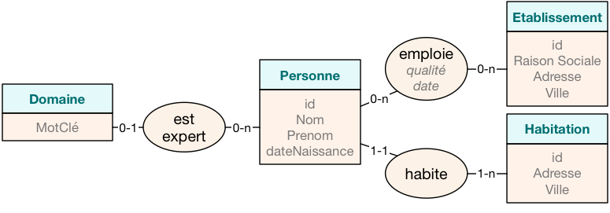
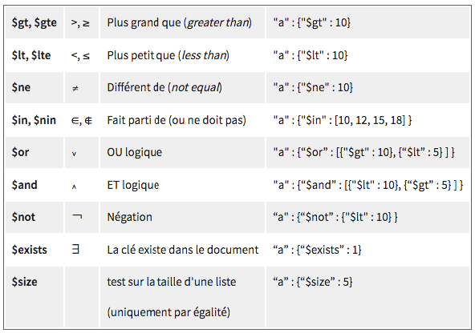
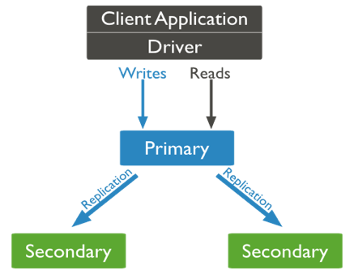
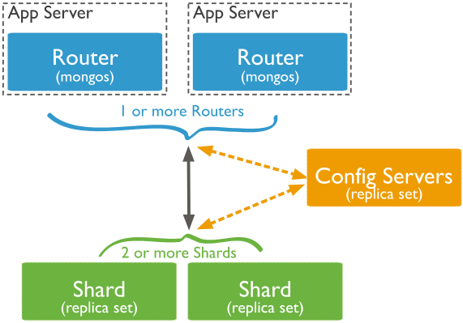

# MongoDB
La partie MongoDB de la formation

## TP 0 - Première manipulation de MongoDB

### Manipulation basique

Dans le repertoire `docker-mongodb`, on lance les containers docker avec la commande `docker-compose up -d`

Ce fichier `docker-compose.yml` utilise la dernière image officielle en date de mongo et expose les ports les plus classiques.

On entre dans le bash de l'image mongo 

	docker exec -it dockermongodb_mongo_1 bash

Mongodb est installé avec plusieurs executables, essayez de les appeler avec --help pour comprendre leur fonctionnement :

* mongod : l'executable serveur ordinaire
* mongos : l'executatble serveur pour les shards
* mongodump : la commande pour dumper la base mongoDB en bson
* mongorestore : l'outil pour restorer une install de mongoDB à partir de fichier .bson
* mongoexport : un exporteur en csv/json
* mongoimport : un importeur de csv/tsv/json
* mongoperf : un outil d'évaluation des performance de l'application
* mongostat : un outil de monitoring
* mongotop : un autre outil de monitoring centré sur les collections
* mongofiles : la commande shell de manipulation des fichiers gridfs
* mongo : le client qui permet de se connecter à la base mongodb

On accède au shell mongoDB avec la commande 

	mongo

Dans ce shell on va pouvoir effectuer des commandes à mongo, pour lister les databases :

	show dbs

On ne créé pas de database dans mongo, elles sont créées à la volée lors de l'ajout d'une collection de document à l'interieur. Pour utiliser la `base big-data-paris` :

	use big-data-paris
	
On utilise une base de données qui n'existe pas tant qu'on a pas ajouté de collection à l'intérieur. COmme on peut le voir avec 

	show dbs
	
La base n'a pas de schéma prédéfini, on va créer un document dans la collection test de la base big-data-paris et cela va créer la collection et la db

	db.test.save (
	{
	  "cours" : "Neo4J",
	  "chapitres" : ["familles", "CAP", "sharding", "choix", "graph"],
	  "auteur" : {
	     "nom" : "CHAABAN",
	     "prenom" : "Jérome",
	     "NB" : "Génial"
	  }
	} )
	
On pourra le constater avec

	show dbs
	show collections
	
Le shell permet de faire toute les manipulations dans la base mongoDB mais une interface va nous donner un confort d'utilisation. Cette interface c'est le logiciels Mongo3T [https://www.robomongo.org/](https://www.robomongo.org/)

On se connecte ensuite à notre serveur mongoDB et on constate la présence de notre DB et de notre collection.

On va récupérer l'ensemble des éléments présents dans la base test, pour ça on peut faire deux commandes différentes mais équivalentes :

	db.getCollection('test').find({})
	db.test.find({})
	
Dans mongoDB, le shell, le système de requètes, les résultats obtenus sont tous en javascript/json.

### La dénormalisation d'une base docummentaire

On compléxifie l'exemple précédent : Une personne peut avoir plusieurs domaine d’expertise, des emplois successifs, et une habitation :

Si je dois intégrer une base de données avec une collection par entité (rectangle) et association (ovales), le nombre de jointures pour les requêtes sur la base NoSQL risque de faire exploser le système. Du coup, des fusions sont nécessaires pour réduire le coût des requêtes. Mais quelles tables doit-on imbriquer ? Dans quel sens le faire ?

#### Dénormalisation du schéma

Voici quelques étapes de modélisation qui vont vous permettre de produire des documents JSON qui répondront à votre demande, tout en minimisant les problèmes de jointures et d’incohérences :

* **Des données fréquemment interrogées conjointement.** Par exemple, les requêtes demandent fréquemment le lieu d’habitation d’une personne. De fait, la jointure devient coûteuse. Accessoirement, cette information étant peu mise à jour, cela pose peu de problèmes. Résultat, l’entité ‘Habitation’ et l’association ‘habite’ sont intégrés à l’entité Personne. Habitation devient un document imbriqué à l’intérieur de Personne, représenté par : “{habite}”
* **Toutes les données d’une entité sont indépendantes.** Prenons l’exemple des domaines d’expertise d’une personne, ils sont indépendants des domaines d’une autre personne. De fait, rapatrier les données de cette entité n’impacte aucune autre instance de Personne. Ainsi, la liste des domaines est importé dans Personne et représenté par : “[domaines]”
* **Une association avec des relations 1-n des deux côtés.** Cette fois-ci, c’est plus délicat pour l’entité Etablissement. Une personne peut avoir plusieurs emplois et un employeur, plusieurs employés. De fait, une imbrication de l’employeur dans Personne peut avoir de gros impacts sur les mises à jour (tous les employés à mettre à jour !). Il est donc peu recommandé d’effectuer une fusion complète. Pour cela, seule l’association est imbriquée sous forme d’une liste de documents, intégrant les attributs (qualité et date), ainsi qu’une référence vers l’employeur. Ainsi : “[{emploie+ref}]”
* **Même taux de mises à jour.** Dans le cas des emplois d’une personne, là également nous pourrions effectuer une fusion de l’association “emploie”. En effet, le taux de mises à jour des emplois est équivalent à celui de la Personne, de fait, sans incidence sur les problèmes de cohérence de données.

	db.test.save({
	  "nom" : "Travers",   "prenom" : "Nicolas",
	  "domaines" : ["SGBD", "NoSQL", "RI", "XML"],
	  "emplois" : [
	    {"id_etablissement" : "100", "qualité" : "Maître de Conférences",
	        "date" : "01/09/2007"},
	    {"id_etablissement" : "101", "qualité" : "Vacataire",
	        "date" : "01/09/2012"}
	  ],
	  "Habite" : {"adresse" : "292 rue Saint Martin", "ville" : "Paris"}
	})

[Ici, la source de cette partie sur open classroom](https://openclassrooms.com/courses/maitrisez-les-bases-de-donnees-nosql/decouvrez-le-fonctionnement-de-mongodb#/id/r-4658824)

## TP 1 - les restaurants de NYC

Pour cette exemple, on va retrouver un dataset qui nous est familier, les restaurants de NYC et leurs inspections sanitaires.

Dans share, décompressez restaurants.json.zip

Puis dans le bash de du container mongo (`docker exec -it dockermongodb_mongo_1 bash`), on va utiliser la commande d'import `mongoimport` pour importer notre fichier dans la base de données 

### import des datas

	mongoimport --db new_york --collection restaurants /tmp/share/restaurants.json
	
On a plus de 25 000 documents en base à présent.

### Manipuler les datas

La documentation officielle de find => [https://docs.mongodb.com/reference/method/db.collection.findOne/#db.collection.findOne]()

On va manipuler la table avec mongo3T, on selectionne la db new_york, et on va récupérer un restaurant :

	db.restaurants.findOne()

Après avoir compris la structure du document et le lien avec le fichier restaurant.json, on continue

### filtrer/projeter

#### filtrer

La documentation officielle de find => [https://docs.mongodb.com/reference/method/db.collection.find/#db.collection.find]()

Pour filtrer les résultats, on passe un paramètre map, supplémentaire à find, pour chercher les restaurants de Brooklyn :

	db.restaurants.find( { "borough" : "Brooklyn" } )
	db.restaurants.find( { "tarif" : "bon marché"} )

On est en javascript, on peut donc utiliser les fonctions javascript directement dans mongodb, pour compter combien de restaurant ont été retrourné par notre filtre sur Brooklin, on applique la fonction count :

	db.restaurants.find( { "borough" : "Brooklyn" } ).count()
	
Un filtre sur plusieurs données de premier niveau :

	db.restaurants.find(
	  { "borough" : "Brooklyn",
	    "cuisine" : "Italian" })

Un filtre sur une données dans une clef imbriqué

	db.restaurants.find(
    { "borough" : "Brooklyn",
      "cuisine" : "Italian",
      "address.street" : "5 Avenue" })

On peut appliquer une expression à nos recherches, ici on chercher les restaurant dont le nom contient pizza quelque soit sa casse (i)

	db.restaurants.find(
    { "borough" : "Brooklyn",
      "cuisine" : "Italian",
      "address.street" : "5 Avenue",
      "name" : /pizza/i }
	)

#### Projeter

Projeter en mongo signifie choisir les champs qu'on va remonter au résultat, par exemple pour indiquer qu'on projette le nom :

	db.getCollection('restaurants').find(
	  {
	    "borough":"Brooklyn",
	    "cuisine":"Italian",
	    "name":/pizza/i,
	    "address.street" : "5 Avenue"},
	  {"name":1}
	)

La valeure 1 sert à indiquer un champs que l'on souhaite projeter, l'_id est projeter par défaut, pour ne projeter que le nom :

	db.getCollection('restaurants').find(
	  {
	    "borough":"Brooklyn",
	    "cuisine":"Italian",
	    "name":/pizza/i,
	    "address.street" : "5 Avenue"},
	  {
              "name":1,"_id":0}
	)
	
La notion de clef imbriqué fonctionne de la même manière sur les projections

	db.getCollection('restaurants').find(
    {"borough":"Brooklyn",
     "cuisine":"Italian",
     "name":/pizza/i,
     "address.street" : "5 Avenue"},
    {"name" : 1,
     "grades.score" : 1}
	)
	
Pour info, aux USA, un score bas est un bon score.

#### filtrer avec des opérateurs

On va ajouter des opérateurs à nos recherches, les opérateurs sont des variables dans MongoDB.
La doc officielle des opérateurs est dispo sur [https://docs.mongodb.com/reference/operator/query/]()

Si on cherche les restaurants les plus propres de Manhattan :

	db.getCollection('restaurants').find(
    {"borough":"Manhattan",
     "grades.score":{$lt : 10}
    },
    {"name":1,"grades.score":1, "_id":0})

Etonné par le résultat ?

> Ce qui est déroutant dans ce résultat, c'est le fait que l'on trouve des scores supérieurs à 10 !
> Nous ne sommes pas en relationnel et ce n'est pas une jointure, ainsi, l'opération "grades.score" : {"$lt" : 10}, veut dire :
> Est-ce que la liste "grades" contient un score (au moins) avec une valeur inférieure à 10 ?
> Et en effet, il y a un score à "2" respectant la question.

Si l'on souhaite ne récupérer que ceux qui n'ont pas de score supérieur à 10, il faut alors combiner la première opération avec une négation de la condition "≥10 ". La condition est alors vérifiée sur chaque élément de la liste.

	db.getCollection('restaurants').find(
    {"borough":"Manhattan",
     "grades.score":{
         $lt:10,
         $not:{$gte:10}
     }
    },
    {"name":1,"grades.score":1, "_id":0})

Si on complique et qu'on souhaite les grades C avec un score inférieur à 40

	db.restaurants.find({
    "grades.grade" : "C",
    "grades.score" : {$lt : 40}
	},
	{"grades.grade":1, "grades.score":1}
	);

Là encore le résultat obtenu est destabilisant, nous obtenons un grade C à 56, mais la condition est vérifié en deux fois pour le document. Un opérateur va permettre de regrouper les deux conditions pour un même élément

	db.restaurants.find({
	"grades" : {
	       $elemMatch : {
	           "grade" : "C",
	           "score" : {$lt :40}
	       }
	}
	},
	{"grades.grade" : 1,"grades.score" : 1}
	);

Là c'est OK.

On va maintenant chercher les noms et quartiers des restaurants dont la dernière inspection (la plus récente, donc la première de la liste) a donné un grade ‘C’. Il faut donc chercher dans le premier élément de la liste. Pour cela il est possible de rajouter l’indice recherché  (indice 0) dans la clé.

	db.restaurants.find(
	  {"grades.0.grade":"C"},
	  {"name":1, "borough":1, "_id":0}
	);

#### fonction Distinct

Afin de lister les différentes valeurs dans la collection, on utise la fonction distinct. Par exemple, pour trouver tous les quartiers présents dans la base :

	db.restaurants.distinct("borough")

Cela fonctionne aussi avec les sous éléments
	
	db.restaurants.distinct("grades.grade");

Voir avec un seul élément des sous éléments

	db.restaurants.distinct("grades.8.grade");
	
#### fonction aggregate

On arrive doucement dans le sérieux. La doc officielle est ici => [https://docs.mongodb.com/reference/method/db.collection.aggregate/#db.collection.aggregate]()

la fonction `aggregate` spécifie des chaînes d'opération (ou pipeline d'aggergation). Il couvre toutes les possibilité de la fonction find et ajoute des possibilité supplémentaire.

Cette fonction aggregate prend une liste d’opérateurs en paramètre. Il existe plusieurs types d’opérateurs de manipulation de données. Nous allons nous concentrer par la suite sur les principaux :

* `{$match : {} }` : C’est le plus simple, il correspond au premier paramètre de la requête find que nous avons fait jusqu’ici. Il permet donc de filtrer le contenu d’une collection.
* `{$project : {} }` : C’est le second paramètre du find. Il donne le format de sortie des documents (projection). Il peut par ailleurs être utilisé pour changer le format d’origine.
* `{$sort : {} }` : Trier le résultat final sur les valeurs d’une clé choisi.
* `{$group : {} }` : C’est l’opération d’agrégation. Il va permettre de grouper les documents par valeur, et appliquer des fonctions d’agrégat. La sortie est une nouvelle collection avec les résultats de l’agrégation.
* `{$unwind : {} }` : Cet opérateur prend une liste de valeur et produit pour chaque élément de la liste un nouveau document en sortie avec cet élément. Il pourrait correspondre à une jointure, à ceci près que celle-ci ne filtre pas les données d’origine, juste un complément qui est imbriqué dans le document. On pourrait le comparer à une jointure externe avec imbrication et listes. (Commande de desimbricage. Permet d’utiliser en aggregat les sous collections.)

Pour reproduire une requète find, par exemple l'affichage des noms et des quartiers des restaurants dont la dernière inspection a conduit à l'obtention d'un grade C :

	db.restaurants.aggregate( [
    { $match : {
        "grades.0.grade":"C"
    }},
    { $project : {
        "name":1, "borough":1, "_id":0
    }}
	] )

L'interpreteur MongoDB est un interpréteur javascript. Il nous permet, par exemple de définir et d'utiliser des variables pour rendre les requètes plus lisibles (chaque onglet de mongo3T possède son contexte d'execution JS, une variable ne sera accessible que dans l'onglet où elle a été définie) :

	varMatch = { $match : { "grades.0.grade":"C"} };
	varProject = { $project : {"name":1, "borough":1, "_id":0}};
	db.restaurants.aggregate( [ varMatch, varProject ] );

#### Tri

On peut ajouter maintenant un tri 

	varSort = { $sort : {"name":1} };
	db.restaurants.aggregate( [ varMatch, varProject, varSort ] );

#### Groupement simple

Comptons maintenant le nombre de ces restaurants (premier rang ayant pour valeur C). Pour cela, il faut définir un opérateur $group. Celui-ci doit contenir obligatoirement une clé de groupement (_id), puis une clé (total) à laquelle on associe la fonction d'agrégation ($sum) :

	varGroup = { $group : {"_id" : null, "total" : {$sum : 1} } };
	db.restaurants.aggregate( [ varMatch, varGroup ] );
	
Ici, pas de valeur de groupement demandé (on compte simplement). Nous avons choisi de mettre la valeur null, on aurait pu mettre "toto", cela fonctionne également. La clé "total" est créée dans le résultat et va effectuer la "somme des 1" pour chaque document source. Faire une somme de 1 est équivalent à compter le nombre d’éléments.

Ce groupement n'apporte pas grand chose, on aurait put retrouver cette valeur avec l'une des deux fonctions suivantes :
	
	db.restaurants.count({"grades.0.grade":"C"})
	db.restaurants.find({"grades.0.grade":"C"}).count()

#### Groupement par valeur

On va essayer de compter le nombre de restaurant par quartier dont la dernière inspection a résulté en une note de C, pour cela, on ferait naturellement :

	varGroup2 = { $group : {"_id" : "borough", "total" : {$sum : 1} } };
	db.restaurants.aggregate( [ varMatch, varGroup2 ] );
	
Le résultat est assez décevant, non? On a fait une fonction de groupe sur la chaine de caractère "borough" ce qui a provoqué un simple compte, pour attaquer la colonne dans ce cas, il faut préfixer la clef du signe `$`

	varGroup3 = { $group : {"_id" : "$borough", "total" : {$sum : 1} } };
	db.restaurants.aggregate( [ varMatch, varGroup3 ] );

On va avoir le résultat attendu.

#### Unwind

On va essayer de répondre à la demande suivante : le score moyen des restaurants par quartiers, et trier par score décroissant (en gros, les quartiers classé par propreté croissante). On constate que le unwind va fonctionner un peu comme un left join mysql.

	varUnwind = {$unwind : "$grades"}
	varGroup4 = { $group : {"_id" : "$borough", "moyenne" : {$avg : "$grades.score"} } };
	varSort2 = { $sort : { "moyenne" : -1 } }
	db.restaurants.aggregate( [ varUnwind, varGroup4, varSort2 ] );

> Ce qu'il est important de noter dans cette fonction aggregate, c’est que les opérateurs sont composés en séquences :  chaque opérateur prend la collection produite par l’opérateur précédent (et non la collection de départ). Ceci permet de créer de longues chaînes d’opérateurs pour faire des calculs lourds.
> Attention ! L’ordre des opérations est très important (projection après les filtrages, tri sur le résultat d’un groupe, filtrage avant ou après unwind/group…).

Dans des cas plus complexes, mongoDB permettra de réalisser en map/reduce avec javascript (nous en verrons un exemple plus tard) mais même sans prendre la pein de faire explicitement du map/reduce, tous les opéreteurs mongoDB sont programmés en map/reduce.

### Mettre à jour des données

#### update

Pour ajouter/modifier un champs (ici "comment") à un document déjà identifié, on utilise update et `$set`

	db.restaurants.update (
	   {"_id" : ObjectId("594b9172c96c61e672dcd689")},
	   {$set : {"comment" : "My new comment"}}
	);
	
Le résultat nous annonce combien ont été trouvé, combien ont été modifié.

Pour supprimer un champs, on utlise update avec `$unset`

	db.restaurants.update (
	   {"_id" : ObjectId("594b9172c96c61e672dcd689")},
	   {$unset : {"comment" : 1}}
	);

Pour modifier des documents par groupe, on peut filtrer la selection et appliquer la modification. On va essayer d'appliquer le commentaire "acceptable" à tous les restaurants qui n'ont jamais été noté C

	db.restaurants.update (
	   {"grades.grade" : {$not : {$eq : "C"}}},
	   {$set : {"comment" : "acceptable"}}
	);
	
Etrange résultat, on constate qu'il s'est passé quelque chose d'inattendu :

	db.restaurants.find ({"grades.grade" : {$not : {$eq : "C"}}})
	
Par défaut MongoDB protège ses données et ses performances et ne permet pas de faire de la mise à jour si importante. Il faut explicitement le réclamer dans la requète :

	db.restaurants.update (
	   {"grades.grade" : {$not : {$eq : "C"}}},
	   {$set : {"comment" : "acceptable"}},
	   {"multi" : true}
	);

#### update et js

Encore une fois, on est dans un fonctionnement de script javascript, on va donc pouvoir géré des cas plus compliqué d'update. Ici on va attribué des points par inspection, 3 pour un A, 1 pour un B et -1 pour C ou pire. Puis pour chaque élément, on va sauvegarder le calcul dans le restaurant en tant que note.

	db.restaurants.find( {"grades.grade" : {$not : {$eq : "C"}}} ).forEach( 
	    function(restaurant){
	        total = 0;
	        for(i=0 ; i<restaurant.grades.length ; i++){
	            if(restaurant.grades[i].grade == "A")         total += 3;
	            else if(restaurant.grades[i].grade == "B")    total += 1;
	            else                                          total -= 1;
	        }
	        restaurant.note = total;
	        db.restaurants.save(restaurant);
	    }
	);

On peut maintenant faire une requète cherchant les restaurants avec la meilleure note 

	db.restaurants.find({}, {"name":1,"_id":0,"note":1,"borough":1}).sort({"note":-1});
	
#### remove

Pour supprimer des documents, on utilise la fonction remove. Comme update, elle est protégée des opérations multiples. Donc pour retirer de la base de données tous les documents avec une note de 0 :

	db.restaurants.remove(
	   {"note":0},
	   {"multi" : true}
	);

## TP 2 - exercice

La base de données à manipuler contient des lieux de différentes catégories : des points d’intérêt (POI), des restaurants (restaurant), des attractions (attraction), des hôtels (accommodation).

1. Importez le jeu de données tour-pedia.json dans une base de données “tourPedia” avec une collection “paris” ;
2. Filtrez les lieux par type “accommodation” et service “blanchisserie” ;
3. Projetez les adresses des lieux de type "accommodation" ;
4. Projetez la note (rating) du dernier commentaire reçu par les documents de category restaurant
5. Projeter la note min des restaurant
4. Projeter la note max des restaurant
5. Projeter la note moyenne des restaurant
4. Filtrez les listes de commentaires (reviews) des lieux, pour lesquelles au moins un commentaire (reviews) est écrit en anglais (en) et a une note (rating) supérieure à 3 (attention, LE commentaire en anglais doit avoir un rang de 3 ou plus) ;
5. Groupez les lieux par catégorie et comptez les ;
6. Créez un pipeline d’agrégation pour les lieux de catégorie "accommodation", et donnez le nombre de lieux par valeur de "services".
7. Updater les restaurants de la base et ajouter un champs typeDeCuisine contenant la valeur indefini
8. Selectionner les 5 restaurants les mieux notés.
8. Updater toute la base de données en ajouter le champs avgRating qui sera la moyenne des ratings
9. Selectionner les 5 restaurants les mieux notés.
10. Faire un update et attribuer un certificat d'excellence (nouveau champs à créer) pour tous les restaurants ayant une bonne note moyenne et un nombre de reviews suffisante (définissez vous même la condition en fonction des données à disposition).

## TP 3 - Admin système simple

### Conf générale

Un ReplicaSet doit contenir au minimum 3 serveurs (1 Primary et 2 Secondary) pour garantir un minimum de tolérance aux pannes. Un ReplicaSet peut contenir jusqu’à 50 serveurs ; toutefois lorsqu’un vote a lieu pour élire le nouveau Primary, au maximum 7 peuvent participer à cette élection (les premiers ayant répondu à l’Arbiter).

Nous allons monter une architecture de replicaset à 4 noeuds :

* 1 primaire
* 2 secondaires
* 1 arbitre

On part d'une image ubuntu fraichment installé sur les 4 machines.

Mongo stocke ses paquets sur un serveur HTTPS (et c'est bien). Mais par contre, il va falloir que notre distribution accepte le https (on installe discrètement nano également) :

	apt-get update && apt-get install apt-transport-https nano wget unzip -y

Il faut ajouter le paquet mongo au repository apt

	echo "deb [ arch=amd64,arm64 ] https://repo.mongodb.org/apt/ubuntu xenial/mongodb-org/3.6 multiverse" | tee /etc/apt/sources.list.d/mongodb-org-3.6.list
	
Et signer le paquet :

	apt-key adv --keyserver hkp://keyserver.ubuntu.com:80 --recv 2930ADAE8CAF5059EE73BB4B58712A2291FA4AD5

On update les paquets apt :

	apt-get update
	
On installe mongo version community

	apt-get install -y mongodb-org
	
On reprend ces étapes sur toutes les machines.

### Lancement replicaset sur le primaire

On créé l'espace de stockage pour notre replicaSet rsBigData

	mkdir /data && mkdir /data/dbRsBigData
	
On lance le serveur csur le replicaSet, dans notre cas on va le faire écouter sur toutes les IPs de la machine : 
	
	mongod --replSet rsBigData --bind_ip_all --dbpath /data/dbRsBigData > /dev/null&
	
On va ensuite initialiser le replicaset sur notre machine primaire, pour ça on se connecte à mongo

	mongo
	
Et dans mongo on lance la commande

	rs.initiate();
	
On constate que mongo est bien primaire sur cette instance et on peut effectuer quelques commandes pour accèder à la configuration ou voir l'état sur replicaSet

	rs.conf();
	rs.status();
	
### Mise en place des machines secondaires

On va lancer les machines secondaires comme la primaire avec les commandes

	mkdir /data && mkdir /data/dbRsBigData
	mongod --replSet rsBigData --bind_ip_all --dbpath /data/dbRsBigData > /dev/null&
	
Une fois ces commandes lancées, mongodb tourne sur nos machines primaire et secondaire sur le même replicaset potentiel `rsBigData`. Par contre, c'est à la macine primaire de les intégrer à sa configuration/

On retourne sur la machine primaire pour ajouter les deux secondaires au replicaset :

	rs.add("dockermongodbcluster_mongo-secondary-a_1");
	rs.add("dockermongodbcluster_mongo-secondary-b_1");
	
On va pouvoir constater la mise en place du replicaSet :

	rs.status()	

### Mise en place de l'arbitre

On va créer un arbitre, pour ça on va en faire un candidat classique (on va juste changer le repertoire de stockage de data) pour le replicaset

	mkdir /data && mkdir /data/dbRsBigDataArb
	mongod --replSet rsBigData --bind_ip_all --dbpath /data/dbRsBigDataArb > /dev/null&
	
On ajoute l'arbitre sur le primaire :

	rs.addArb("dockermongodbcluster_mongo-arbitre_1")
	
On va tester un peu la bète sur le primaire :

	cd
	wget https://s3-eu-west-1.amazonaws.com/course.oc-static.com/courses/4462426/restaurants.json_.zip
	unzip restaurants.json_.zip
	mongoimport --db new_york --collection restaurants restaurants.json
	mongo
	
Dans mongo (sur les différents noeuds)
	
	use new_york
	db.restaurants.find({})
	
Sur les secondaires il faut autoriser les secondaires à répondre au requête :

	rs.slaveOk()

On va mettre le primaire en panne, constater l'election d'un des secondaires, requeter la donnée, et remonter le primaire qui est maintenant secondaire.

### Conf plus simple

#### Ajouter les machines au replicaset

Si toutes les machines tournaient, on aurait pu configurer le primary et tous les secondary en 1 fois :

	rsconf = {
          _id: "rsBigData",
          members: [
                     {_id: 0, host: "dockermongodbcluster_mongo-primary_1"},
                     {_id: 1, host: "dockermongodbcluster_mongo-secondary-a_1"},
                     {_id: 2, host: "dockermongodbcluster_mongo-secondary-b_1"}
                   ]
        };
	rs.initiate (rs.conf) ;

#### le fichier de conf mongod.conf

EN prod, il est préféreable de gérer la config du serveur dans un fichier plutôt que de l'improviser à chaque fois qu'on lance le daemon Mongo. On peut en effet gérer la config du serveur dans `/etc/mongod.conf`

	systemLog:
	  destination: file
	  path: "/var/log/mongodb/mongod.log"   #Fichier de log que nous verrons ensuite
	  logAppend: true
	
	storage:
	  journal:
	     enabled: true
	
	processManagement:
	  fork: true
	#Permet de lancer le processus et de reprendre la main
	
	net:
	  bindIp: 0.0.0.0
	  port: 27017
	#Adresse du serveur local et port d’écoute (ici on écoute sur tout ce qui n'est pas conseillé en production)
	
	replication:
	  oplogSizeMB: 512
	  replSetName: rs0
	#Le nom de votre ReplicaSet
	
	sharding:               #A voir dans le TP suivant
	  clusterRole: shardsvr #C’est le mode par défaut. Sinon "configsvr"
	  
Pour lancer le daemon en utilisant cette configuration :
	
	mongod --config mongod.conf

La doc de configuration => [https://docs.mongodb.com/manual/reference/configuration-options/]()

#### La réplication, comment ça marche?

On est dans un fontionnement proche de la replication maitre esclave mysql, en effet la réplication va se basé sur un système de journalisation qui sera lu par les membres du réplicaSets pour assurer la réplications.

Ce log est lui même une collection MongoDB qui a été créé à l'initialisation du replicaSet :

On peut aller le consulter comme une table classique :

	use local;
	db.oplog.rs.find().pretty();
	
En fonction de la charge d'écriture du replicaSet il peut être interressant d'augmenter la taille maximale de ce journal. La taille par défaut dépend de plusieurs paramêtres : en particulier l'OS et le moteur de stockage.

Le moteur de stockage par défaut de mongoDB est wiredTiger : [https://docs.mongodb.com/v3.2/core/wiredtiger/index.html]()

#### Haute disponibilité?

Pour spécifier l'odre de reprise du primary des machines lors d'une election :

	cfg = rs.conf();
	cfg.members[0].priority = 0.5;
	cfg.members[1].priority = 2;
	cfg.members[2].priority = 3;
	
	rs.reconfig(cfg);
	
Si on stoppe le primary ou si on le met juste de coté pour forcer une réélection :

	rs.freeze(120)
	
Concerant la gestion de la disponibilité, plusieurs politique sont proposées :

* Primary : valeur par défaut, lecture sur le serveur d’écriture.
* PrimaryPreferred : si jamais le PRIMARY n’est plus disponible, les requêtes sont routées vers le SECONDARY en attendant que celui-ci réapparaisse (ou qu’un nouveau soit élu).
* Secondary : Routé uniquement sur les SECONDARY. Cela soulage la charge du serveur primaire. Toutefois, on perd alors en cohérence puisque les données sont répliquées de manière asynchrone.
* Nearest : Le serveur physique le plus proche sur le réseau (latence la plus faible) est interrogé directement par le client. Là non plus, la cohérence n'est pas garantie.

C'est le paramètre localThresholdMS dans la réplication qui va indiquer quelle politique est appliqué sur les lectures

	replication :
	    localThresholdMS: <"primary"|"primaryPreferred"|"Secondary"| "Nearest">

On peut également changer la manière dont les données sont répliqué (on change de position sur le diagramme de CAP mais c'est au prix de performance plus faible).

	replication :
	    readConcern: <"majority"|"local"|"linearizable">

* local : mode par défaut, les mises à jours sont asynchrones, seul le primaire est consulté
* majority : on vérifie que la majorité des replicats est synchronisée
* linearizable : la lecture des données sera ordonnée en fonction de l’instant d’écriture et de lecture. Cela réduit considérablement les performances de MongoDB

## TP 4 - Admin système complexe

On va gérer un cluster plus puissants en mettant en place une politique de sharding puissante.

Pour ça, on a 3 types de noeuds mongo :

* routeur : mongos. Il s’occupe du routage des requêtes. Il stocke les informations sur l’arbre permettant de répartir les données (voir le chapitre sur le sharding). Ainsi, bien qu’il soit un point central de l’architecture, le temps de traitement est rapide. Il faut minimum deux routeurs pour permettre de gérer la tolérance aux pannes de celui-ci.
* Serveur de configuration : Config Server. Ils s’occupent de la connaissance du réseau, aussi bien au niveau des routeurs que les shards. Ils vont ainsi stocker les informations sur l’arbre de routage utilisé par les routeurs ; permettant de synchroniser celui-ci et de l’intégrer à un nouveau routeur. Ils gèrent également les informations de répartition de charge sur les différents shards, et la structure des ReplicaSets (vu dans le chapitre précédent) permettant de rééquilibrer la charge des serveurs si la répartition des données est inégale. Les ConfigServers sont au nombre de 3 et organisés en ReplicaSet pour garantir l’intégrité du réseau. L’idéal est de les placer à des endroits clés du réseau pour des questions de pérennité du système (rack différents, proches des routeurs).
* Des serveurs de données : Shard. Ils contiennent l’ensemble des données, les chunks. Ils peuvent contenir plusieurs chunks, mais pas forcément contigus (tri des données de l’arbre).

La configuration minimum est  2 mongos, 3 Config Servers et 2 shards.

### Les configs serveurs

On va ajouter les paquets de manipulation réseau
	
	apt-get update && apt-get install net-tools nano iputils-ping -y
	
	netstat -paunt

On va lancer sur les serveurs de configs le replicaSet en mode config server

	mkdir /data
	mkdir /data/confRsBigData
	mongod --configsvr --replSet rsBigDataConf --bind_ip_all --dbpath /data/confRsBigData > /dev/null&
	
Puis sur le a, on va initer le replicaSet et ajouter l'autre serveur au replicaSet

	rs.initiate();
	rs.add("dockermongodbsharding_mongo-config-b_1:27019");
	rs.add("dockermongodbsharding_mongo-config-c_1:27019");

### Les shards

On va lancer sur les deux shards des replicaSet de une machine.

Sur le premier :

	mkdir /data
	mkdir /data/shardRsBigData
	mongod --shardsvr --replSet rsBigDataSh1 --bind_ip_all --dbpath /data/shardRsBigData > /dev/null&
	
et en mongo
	
	rs.initiate(
	   {
	      _id: "rsBigDataSh1",
	      version: 1,
	      members: [
	         { _id: 0, host : "dockermongodbsharding_mongo-shard-rs-a_1:27018" },
	      ]
	   }
	)
	
Sur le deuxième :
	
	mkdir /data
	mkdir /data/shardRsBigData
	mongod --shardsvr --replSet rsBigDataSh2 --bind_ip_all --dbpath /data/shardRsBigData > /dev/null&
	
et en mongo

	rs.initiate(
	   {
	      _id: "rsBigDataSh2",
	      version: 1,
	      members: [
	         { _id: 0, host : "dockermongodbsharding_mongo-shard-rs-b_1:27018" },
	      ]
	   }
	)
	
### Les routeurs

On va lancer les routeurs mongo en les connectant au serveurs de config

	mongos --configdb rsBigDataConf/dockermongodbsharding_mongo-config-a_1:27019,dockermongodbsharding_mongo-config-b_1:27019,dockermongodbsharding_mongo-config-c_1:27019 --bind_ip_all --port 27017 > /dev/null&
	
On se connecte ensuite à mongo sur un routeur

	mongo
	
Et on va ajouter les noeuds de sharding :

	sh.addShard( "rsBigDataSh1/dockermongodbsharding_mongo-shard-rs-a_1:27018");
	sh.addShard( "rsBigDataSh2/dockermongodbsharding_mongo-shard-rs-b_1:27018");
	
Pour vérifier la config

	sh.status()
	
### On a notre noeud de sharding complètement configuré, on va répartir les datas

On va créer une base tesdb et une collection test, les documents seront répartis dans les shards par son _id :

	use testDB;
	sh.enableSharding("testDB");
	db.createCollection("test");
	db.test.createIndex({"_id":1});
	sh.shardCollection("testDB.test",{"_id":1});
	
> enableSharding ne marche que sur une collection préalablement vide. Toute collection déjà existante ne peut être distribuée. Il faudra ainsi importer les données dans la collection « shardée ».

On va réimporter les restaurants dans cette nouvelle config depuis un routeur :

	apt-get update && apt-get install wget unzip -y
	cd
	wget https://s3-eu-west-1.amazonaws.com/course.oc-static.com/courses/4462426/restaurants.json_.zip
	unzip restaurants.json_.zip
	mongoimport --db testDB --collection test restaurants.json
	mongo

On peut vérifier ensuite les shards 

	sh.status()
	

### Stratégie de distribution

#### Requête par zone

On peut aller plus loin que laisser le système répartir ses noeuds, par exemple on peut répartir les documents par zipcode 

	sh.shardCollection("testDB.test2", {"address.zipcode" : 1});
	
Néanmoins, on ne contrôle pas encore la répartition, pour ça on doit préciser notre politique de répartition :

	sh.addTagRange("testDB.test2", 
	    {"address.zipcode": "10001"}, {"address.zipcode":  "11240"},
	    "NYC")
	sh.addTagRange("testDB.test2", 
	    {"address.zipcode": "94102"}, {"address.zipcode":  "94135"},
	    "SFO")

En faisant cela on a créé un range NYC et un range SFO (on ne les a pas encore attribué au shard)

En cas de surcharge d'un noeud, on pourra reprendre les ranges en les divisant:

	sh.addTagRange("testDB.test2",
	    {"address.zipcode": "10001"}, {"address.zipcode": "10281"},
	    "NYC-Manhattan")
	sh.addTagRange("testDB.test2",
	    {"address.zipcode": "11201"}, {"address.zipcode": "11240"},
	    "NYC2-Brooklyn")

Pour associer les tags aux replicaSet de sharding :

	sh.addShardTag("rsBigDataSh1", "NYC")
	sh.addShardTag("rsBigDataSh2", "NYC")
	sh.addShardTag("rsBigDataSh1", "SFO")

Ces informations sont stockés dans dans la base config, on peut les retrouver en faissant des requètes de bases :

	use config;
	db.shards.find({ "tags" : "NYC" });

#### Requête par catégorie

MongoDB ne permet qu'une seule méthode de répartition par collection mais si l'on a des requètes à optimiser sur une catégorie on peut choisir de répartir les documents par un hachage 

	sh.shardCollection( "testDB.test3", { "borough" : "hashed" } )

Attention, on ne supportera plus que des requètes d'égalité sur la clef de hashage et plus d'interval ou de tri.

### Index

Après avoir reparti une collection par shard, on se retrouve avec des executions de requètes plus longue 

	db.test.find({"address.street" : "3 Avenue"}).explain()
	
La fonction ".explain()" appliquée à une requête permet de consulter le plan d’exécution généré. Ici, le plan « WinningPlan » possède une étape (stage) « SHARD_MERGE » qui effectue la fusion des résultats provenant de deux « COLLSCAN » (« Collection Scan »), en l’occurrence un scan complet de la collection pour chaque shard. Cela correspond à une lecture complète du contenu des chunks, ce qui n’est pas très efficace.

	db.test.createIndex({"address.street" : 1})

Si on refait la même requète, on constate l'utilisation de IXSCAN, l'index existe et est consulté sur tous les shards. Contrairement à une requète sur la clef de sharding qui peut n'impliquer que les shards concernés, cette requète utilisera les index de tous les shards mais plus les valeurs.

## TP 5 - l'exercice du formateur fainéant

Et revoilà au loin le formateur fainéant, il va encore nous sortir tout prèt de sa manche un TP pompé sur le net.

En effet : [http://b3d.bdpedia.fr/mongodb_tp.html]()

## TP 6 - GridFS

GridFS est un systeme de stockage qui va permettre de franchir la limite théorique de 16mb par document imposé par mongo en stockant un fichier en plusieurs parties.

On va pouvoir stocker des fichiers dans une une table dédié FS. Ces fichiers seront ensuite référencés dans la deocument source en utilisant leur adresse de sharding.

On manipulera les fichiers avec la commande mongofiles

Dans un cas d'usage de développement classique, on utilisera un des nombreux drivers disposnible en fonction du langage :

* https://github.com/lykmapipo/mongoose-gridfs
* http://api.mongodb.com/python/current/api/gridfs/
* http://api.mongodb.com/java/current/com/mongodb/gridfs/GridFS.html
* ...

Pour notre exemple on va télécharger quelques images sur le serveur et les uploader sur notre installation de mongoDB avec mongofiles

	apt-get update && apt-get install net-tools nano iputils-ping wget -y
	cd
	wget https://www.dokkan-battle.fr/wp-content/uploads/2017/08/dragon-ball-z-death-232158-jpg-997067.jpg -O image1.jpg
	wget https://i.ytimg.com/vi/eoJhC8lSq8I/maxresdefault.jpg -O image2.jpg
	wget https://vignette.wikia.nocookie.net/dragonball/images/5/5c/Dragon_ball_z_vol_68_babidi_rivals_image_oTPbVUjVjWTdLjq.jpeg/revision/latest?cb=20100114064458 -O image3.jpg
	wget https://www.dragon-ball-z.org/galerie/Sangohan/dragon-ball-z-sangohan.jpg -O image4.jpg
	wget http://download.blender.org/peach/bigbuckbunny_movies/big_buck_bunny_480p_surround-fix.avi -O video.mp4
	
On va créer la collection gfs dans la base testGFS. Et on va ajouter les fichiers. Documentation officielle de mongofiles : [https://docs.mongodb.com/manual/reference/program/mongofiles]()

	mongofiles -d testGFS put image1.jpg
	mongofiles -d testGFS put image2.jpg
	mongofiles -d testGFS put image3.jpg
	mongofiles -d testGFS put image4.jpg
	mongofiles -d testGFS put video.mp4

Dans robo3T on peut constater l'ajout dans la base de données de collections spécifiques à gridFS qui vont stocker les fichiers en blocs de 16MB maximum. Les fichiers dans fs.files découpé dans fs.chunks.

Pour lister tous les fichiers :
	
	mongofiles -d testGFS list

Pour supprimer un fichier :

	mongofiles -d testGFS delete image1.jpg

On vérifie :

	mongofiles -d testGFS list

Pour chercher tous les fichiers dont le nom contient image

	mongofiles -d testGFS search image

Pour chercher tous les fichiers dont le nom contient video

	mongofiles -d testGFS search video

Pour récupérer le fichier video.mp4

	mongofiles -d testGFS get video.mp4

## TP 7 - exercice 2

Si on a le temps on va refaire un exercice honteusement volé :

[https://stph.scenari-community.org/contribs/nos/Mongo2/co/Mongo_Exercices.html]()