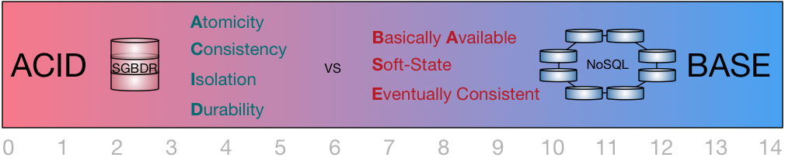
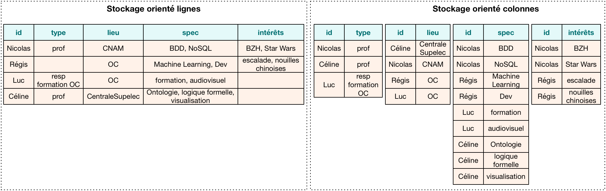
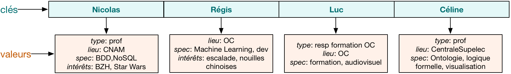
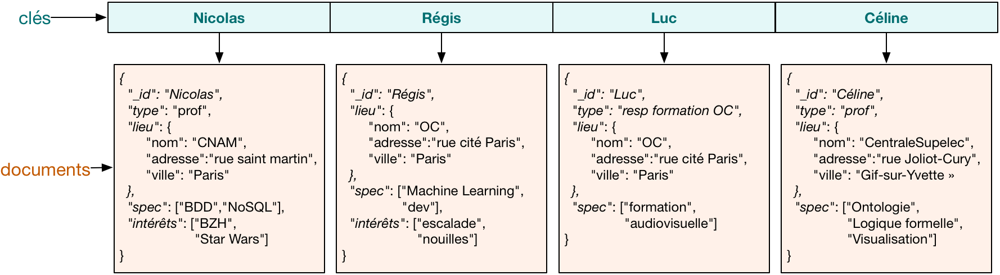
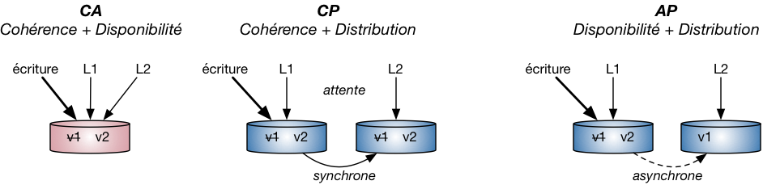
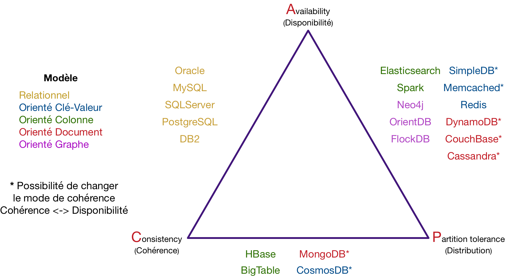
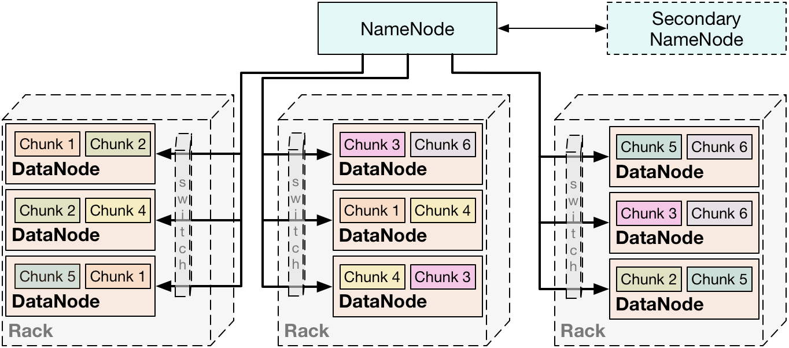
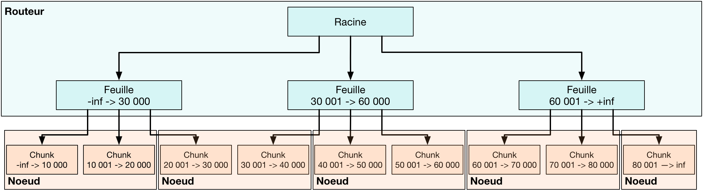
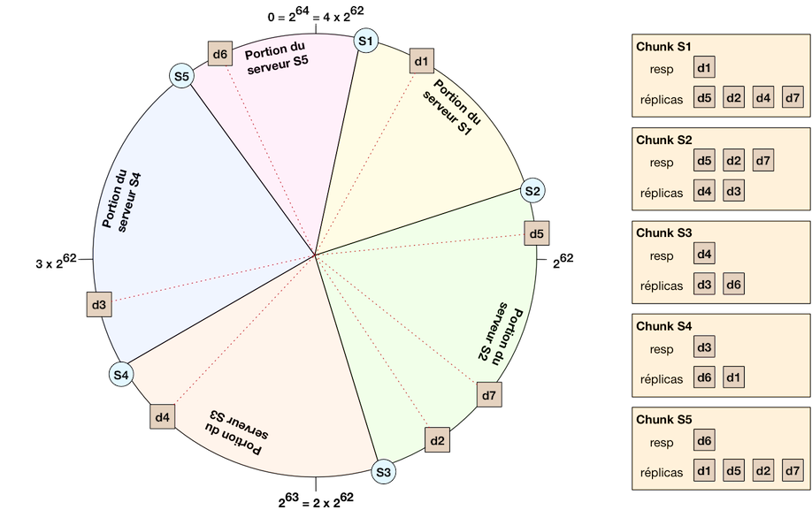

# Pré-Requis formation Big-Data

Un certain nombre de concepts sont nécessaires pour aborder une formation tel que la formation Big-Data. En effet, le Big-Data n'a pas été le premier enjeu de l'informatique, loin s'en faut. Ci-après les pré-requis necessaire pour bien apprécier le reste de la formation.

## Qui sommes-nous ?

Qui suis-je? Et qui sommes-t'on?

## Slack

Notre outil de collaboration, on va tous le rejoindre.

## Quizz

RDV sur [http://socrative.com]()

## GIT

Ce fichier est versionné sur un repo github publique. Si vous arrivez à le lire c'est que vous êtes déjà en contact avec GIT.

### Qu'est-ce que c'est ?

GIT est un versionneur de contenu, il permet de consever une trace local ou sur un serveur distant de modification dans un fichier. Il est habituellement utilisé pour gérer des versions de codes mais nous l'utilisons ici pour diffuser et versionné les supports de travails de la formation Big Data.

Il existe deux types de gestionnaires de version :

* **Modèle centralisé** : un serveur central contrôle toute la base de code du logiciel. Exemples de logiciels de versioning utilisant un modèle centralisé : SVN, CVS.

* **Modèle distribué** : toutes les machines ont accès à la base de code, pas besoin de passer par un serveur central. Exemples de logiciels de versioning utilisant un modèle distribué : Git, Mercurial, Bazaar.

### La console et les GUIs

On abordera la console plus tard dans cette série de pré-requis. Si vous n'avez pas de client GIT installé sur vos machines, je vous propose d'utiliser pour les usages les plus simples que nous allons avoir pendant ce cours le très simple github desktop : [https://desktop.github.com/](https://desktop.github.com/). Il fait el travail pour toute les opérations de bases, il est multiplateforme et pas très lourd. Pour aller plus loin et pour des utilisations plus complexes : [https://www.sourcetreeapp.com/](https://www.sourcetreeapp.com/) ou [https://www.gitkraken.com/](https://www.gitkraken.com/)

#### Récupérer le contenu de ce repo

Je vous propose d'utiliser GitHub desktop pour venir télécharger en local ce repo. Cela s'appelle cloner un repo. pour cela. Une fois que c'est fait. On va mettre en pause GIT pour un moment et on va s'attaquer à Docker.

## Docker

### Docker, c'est quoi ?

Dans le temps, lorsqu'on était un développeur web sous windows, on testait notre code en local sur des solutions comme EasyPHP ou WAMP server, cela nous permettait de simuler à peu près l'environnement finale de dev. Mais pas vraiment parce que des différences existaient entre la stack WAMP et LAMP. 

Puis pour palier à ces problématiques, il a été utilisé des machines virtuelles. Ces machines virtuelles nous permettaient d'executer dans un logiciel adapté une image correspondant à la configuration du serveur final.

Maintenant, Docker nous permet de versionner avec notre code la configuration nécessaire pour l'executer dans les conditions les plus proches de l'instance de production. Tellement proche que les containers dockers peuvent être hébergés en production tel quel sur les principaux fournisseur de Cloud Amazon, Google et Microsoft.

#### Images

Les images sont des templates de configuration de container. On trouve sur Docker Hub de nombreuses images de base pour réaliser des tests.

Par exemple : [https://hub.docker.com/_/ubuntu/](https://hub.docker.com/_/ubuntu/)

#### Containers

Les container sont les composants qui executent les images. Ils continnents les applications, les dépendances mais partagent le même noyau.

#### Docker Daemon

C'est l'outil qui va manager les containers.

#### Docker clients

Ce sont les commandes de controle des containers.

#### Docker registry

Les images sont enregsitré dans des registry. Elles sont identifié par un ID et un tag. par exemple pour ubuntu, l'ID de l'image sera "ubuntu" et le tag les versions cibles par exemple "ubuntu:18.04" pour la version d'avril 2018 de l'OS.

#### Dockerfile

Un docker file est un fichier descriptif qui va permettre de modifier des images existantes. Par exemple, on va pouvoir partir de l'image d'ubuntu et y installer nodeJS.

### Installation

Ici il va falloir que chacun adapate sa méthode à son matériel. En effet, l'installation (et même la manière de fonctionner) va différer entre les différents OS. 

* Si tu es sous Linux, trouve un Pas à Pas avec récupération du dernier Repo Docker pour votre distrib (les versions embarqués par défaut sont à proscrire car trop anciennes).
* Si tu es sur Mac OS, c'est le plus facile => [https://www.docker.com/community-edition](https://www.docker.com/community-edition)
* Si tu es sous windows 10 pro, pas de problème => [https://store.docker.com/editions/community/docker-ce-desktop-window](https://store.docker.com/editions/community/docker-ce-desktop-windows)
* Si tu es sur une autre version de windows, je te conseille de créer un double boot Linux sur ta machine car les anciennes versions sont vraiment très mal supportées. Si tu souhaites faire tourner un Docker à tes risques et périls (même s'il n'y a aucun risque) sur ton OS : [https://docs.docker.com/toolbox/overview/](https://docs.docker.com/toolbox/overview/)

### Test
	
	docker run hello-world

	docker run -it ubuntu:latest bash
	cat /etc/issue
	
	docker run -it ubuntu:16.04 bash
	cat /etc/issue
	
### Docker-compose

Pour manipuler docker compose et docker, nous allons tenter d'installer ensemble gitlab sur notre machine. On va partir des informations présentées sur ce repo : [https://github.com/sameersbn/docker-gitlab](https://github.com/sameersbn/docker-gitlab)

Le fichier docker-compose.yml est également présent dans le dossier docker de ce repo, il a de plus était modifié et a été testé pour fonctionné sur OSX.

### Exercice

Avant d'attaquer le coté UNIX, je vous prospose avec l'aide de google, en se servant du docker hub et de ce que nous venons de voir de faire tourner une boutique prestashop en local sur nos machines avec Docker. 

A vous de jouer.

## Console/Shell/Linux

Maintenant qu'on a un docker d'installer, et comme on va faire pas mal de ligne de commande (simple). On a lancé un premier bash avec docker. On va réutilise la même image et accèder au bash de la dernière version d'Ubuntu

	docker run -ti ubuntu:latest bash
	
L'invit de commande ressemble à ça 

	root@00bc8b06e004:/#

Le premier élément est l'utilisateur courant ici "root", le @ est un caractère de liaison, il indique que l'utilisateur "root" est connecté à la machine qui s'appelle "00bc8b06e004" qui est dans notre cas l'id du container Docker, c'est le nom de la machine. Le ":" est un nouveau séparateur qui introduit à sa suite le répertoire courant ici "/".

Contrairement à un ordinateur sous windows, la racine de fichier d'un système UNIX est / et pas C:\ par exemple.

Le dernier symbole indique le niveau de l'utilisateur : 

* $ : utilisateur avec des droits limités
* \# : super utilisateur avec tous les droits

On peut vérifier le nom de la machine avec la commande : 

	more /etc/hostname
	
### Les premières commandes

On va éxecuter quelques commandes de base du sytème :

Afficher la date et l'heure courante de la machine :

	date

Afficher le contenu d'un dossier

	ls

Les commandes peuvent prendre des paramêtres de type court ou long.

#### Paramètre court

Ils sont constitués d'une lettre, préfixés d'un tiret et peuvent être combinés. Si on doit y passer une valeur, elle est généralement passé avec un espace à la suite du paramètre.

	ls -l
	ls -a
	ls -l -a
	ls -la
	ls -F
	ls -h
	ls -larth
	
#### Paramètre long

Ils sont constitués d'une chaine de caractère, préfixés d'un double tiret et ne peuvent être combinés. Si on doit y passer une valeur, elle est généralement passée avec un "=" à la suite du paramètre.

	ls --all

#### Paramètres autres

Si on ajoute sur la commande ls un paramètre sans "-" ou "--", la commande ls va lister les fichiers du repertoire correspondant.

	ls usr
	ls -la usr
	
### S'y retrouver avec les commandes

Il convient d'user et d'abuser de la tabulation. La tabulation doit être la commande la plus usée d'un admin système.

Retrouver ces commandes historisées (flèches, history, ctr+R, !!)

Le paramètre -h ou --help est souvent supporté par les commandes et donnent une description plus concise et fficace que man qui est plus détaillé.

Google a aussi souvent connaissance de tout.

### Le gestionnaire de paquet

Sur IOS, on a l'appStore, bien avant IOS debian a eu son apt-get. Et en plus c'ets gratuit.

	apt-get update
	apt-get upgrade
	apt-get dist-upgrade
	apt-get install locate
	
	updatedb
	locate --help
	
	apt-cache search nano
	apt-get install nano
	apt-get install git
	apt-get autoremove git

### Les raccourcis clavier pratiques

* `ctrl+C` interrompre un processus
* `ctrl+R` recherche dans l'historique
* `ctrl+L` vider l'écran equivalent à la commande `clear`
* `ctrl+A` place le cureseur en début de commande
* `ctrl+E` place le cureseur en fin de commande
* `ctrl+U` supprime tout à gauche du curseur
* `ctrl+K` supprime tout à droite du curseur
* `ctrl+W` Supprime le mot situé à gauche du curseur
* `ctrl+Y` Récupère le dernier texte supprimé par un des trois raccourcis précédents
	
### Les fichiers

On a vu que la racine du système était "/". On connait la commande ls. A la racine on a :

* /bin : contient des programmes (exécutables) susceptibles d'être utilisés par tous les utilisateurs de la machine.
* /boot : fichiers permettant le démarrage de Linux.
* /dev : fichiers contenant les périphériques. En fait – on en reparlera plus tard – ce dossier contient des sous-dossiers qui « représentent » chacun un périphérique. On y retrouve ainsi par exemple le fichier qui représente le lecteur CD.
* /etc : fichiers de configuration.
* /home : répertoires personnels des utilisateurs.

On peut naviguer dans ces repertoires avec la commande cd :

	cd /bin
	cd ..
	cd boot
	cd ../bin

Pour accèder au dossier personnel de l'utilisateur courant, on utilise la commande
	
	cd
	cd ~

Pour connaitre notre position dans l'arborescence de navigation :

	pwd

Pour avoir ou sont situés les commandes

	which

Pour connaitre la taille d'un repertoire (s omet les sous dossiers)

	du
	du -a
	du -h
	du -sh

Voir un fichier: `cat`, `less`, `more`, `head`, `tail`

On va tester dans le dossier de log `/var/log`

	cat
	cat -n
	tail -f

Pour créér un fichier : `touch`

Pour créér un dossier : `mkdir`

	cd
	touch testfile.txt
	mkdir oneDir
	mkdir -p one/two/three/dir

Pour les manipuler `cp`, `mv`
	
	cp testfile.txt testfile_copy.txt
	cp testfile.txt oneDir/
	cp testfile.txt oneDir/testfile_copy.txt
	cp -R one oneCopy
	cp *.jpg mondossier/
	cp so* mondossier/
	mv *.jpg mondossier/
	rm testfile.txt
	rm testfile.txt testfile_copy.txt
	rm -rf one

Les liens entre fichier (physisque et symbolique) la commande `ln`

	mkdir tests
	cd tests
	touch fichier1
	ln fichier1 fichier2

Les deux fichiers pointent vers le même emplacement mémoire. Modifier l'un revient à modifier l'autre, la mémoire n'est libéré que si tous les fichiers sont supprimés.

Lien symbolique (comme un raccourci)
	
	rm fichier2
	ln -s fichier1 fichier2
	ls -l

Rechercher des fichiers `locate`, `find`, `grep`

	find /var/log/ -name "syslog"
	find -name "fichier"
	find / -size +2M
	grep alias .bashrc
	grep -i alias .bashrc
	grep -ni alias .bashrc
	
### Le réseau

	ping
	traceroute
	ifconfig
	nano /etc/hosts
	telnet
	whois

### Nano

Nano est un éditeur de texte en ligne de commande. Il n'est pas le seul il existe emacs, vim et d'autres.

	nano testfile.txt
	nano /etc/nanorc
	nano .bashrc

Si vous souhaitez ajouter des alias dans .bashrc

	alias nom='commande'

### Un peu de GIT en console

	cd
	mkdir theRepo
	git init
	ls -la
	touch checklist-prerequis.md
	git add checklist-prerequis.md
	git commit -m "Ajouté ma checklist-prérequis.md (woohoo!)"
	

### Docker en console

#### Lister toutes les images disponibles en local

	docker images
	
#### Lister des containers

Pour ne lister que les containers lancés

	docker ps

Pour lister tous les containers disponibles
	
	docker ps -a

#### Lancer une collection de containers décrite par un fichier docker-compose.yml

	docker-compose up
	docker-compose up -d
	docker-compose up -d --build

	docker-compose down
	
### Exercice

Dans votre dossier utilisateur :

1. Créé un dossier exercice
2. Naviguer dans ce dossier
3. Créer un fichier samuelIsAPoet.txt
4. Ajouter le contenu d'un texte que vous trouverez sur slipsum.com dans le fichier
5. Trouver la taille de ce fichier
6. Créer un lien symbolique de samuelIsAPoet.txt, appelez le comme vous le souhaitez
7. Supprimer le fichier samuelIsAPoet.txt (qu'est-il arriver à notre lien symbolique?)
8. Mesurer le temps de réponse entre les DNS de google et de cloudflare. Lesquels sont les plus rapides?
9. Installer le paquet https://doc.ubuntu-fr.org/caca-utils. Récupérer une image de votre choix avec wget et laisser la magie se produire.
10. BONUS : mettre en place un serveur web de votre choix et bricoler le hosts de la machine virtuelle et le vhost du serveur web pour que la commande lynx http://www.google.com affiche une citation de la série Kaamelott de votre choix.

## Re GIT

### Mettre à jour le repo

	Git pull

### Les branches

	git branche notreBranche
	git checkout noreBranche

### Exercice

1. Créer un repo sur github.com appelé exerciceBigData
2. cloner ce repo
2. Ajouter un fichier de votre choix
3. Commiter avec un message décrivant l'action que vous venez d'effectuer
4. Ajouter un second fichier
3. Commiter avec un message décrivant l'action que vous venez d'effectuer
6. Supprimer le premier fichier
7. Afficher l'état du repo local en comparaison avec le serveur github
8. Envoyer les modifs au serveur github
9. Créer une branche, ajouter un nouveau fichier, commiter et pusher avec Github
10. Facultatif: supprimer votre repo

## JSON

* https://la-cascade.io/json-pour-les-debutants/ 
* http://sdz.tdct.org/sdz/serialisez-vos-objets-au-format-json.html

## REGEX

 * https://www.lucaswillems.com/fr/articles/25/tutoriel-pour-maitriser-les-expressions-regulieres

### Exercice

1. Ecrire une regex qui valide les numéros FR au format international comme suit +33(0)1-22-33-44-55
2. Ecrire une regex qui vérifie qu'un chemin de fichier est correct depuis la racine linux et possède une extension entre 2 et 4 caractères (/usr/RAIT/test-fichier.txt)
3. Ecrire une regex qui va changer 

## SQL

* https://wiki.postgresql.org/wiki/Sample_Databases
* https://community.embarcadero.com/article/articles-database/1076-top-3-sample-databases-for-postgresql
* https://hackernoon.com/how-to-query-jsonb-beginner-sheet-cheat-4da3aa5082a3
* https://blog.codeship.com/unleash-the-power-of-storing-json-in-postgres/

### MySQL

cf. le dossier mysql

### PgSQL

cf. le dossier pgsql

# Le NoSQL (en route vers la big data)

Un très bon cours sur Open Classroom : [https://openclassrooms.com/courses/maitrisez-les-bases-de-donnees-nosql](https://openclassrooms.com/courses/maitrisez-les-bases-de-donnees-nosql)

## Pourquoi

Contrainte d’écriture. Contrainte de lecture. Enjeu de performance. 

### Limitation du SQL et du modèle ACID

ACID thanks to wikipedia : [https://en.wikipedia.org/wiki/ACID](https://en.wikipedia.org/wiki/ACID)

#### Atomicity

Atomicity requires that each transaction be "all or nothing": if one part of the transaction fails, then the entire transaction fails, and the database state is left unchanged. An atomic system must guarantee atomicity in each and every situation, including power failures, errors and crashes. To the outside world, a committed transaction appears (by its effects on the database) to be indivisible ("atomic"), and an aborted transaction does not happen.

#### Consistency

The consistency property ensures that any transaction will bring the database from one valid state to another. Any data written to the database must be valid according to all defined rules, including constraints, cascades, triggers, and any combination thereof. This does not guarantee correctness of the transaction in all ways the application programmer might have wanted (that is the responsibility of application-level code), but merely that any programming errors cannot result in the violation of any defined rules.

#### Isolation

The isolation property ensures that the concurrent execution of transactions results in a system state that would be obtained if transactions were executed sequentially, i.e., one after the other. Providing isolation is the main goal of concurrency control. Depending on the concurrency control method (i.e., if it uses strict – as opposed to relaxed – serializability), the effects of an incomplete transaction might not even be visible to another transaction.

#### Durability

The durability property ensures that once a transaction has been committed, it will remain so, even in the event of power loss, crashes, or errors. In a relational database, for instance, once a group of SQL statements execute, the results need to be stored permanently (even if the database crashes immediately thereafter). To defend against power loss, transactions (or their effects) must be recorded in a non-volatile memory.

### Un base relationnel c'est quoi ?

La structure ? Les contraintes ? L'algèbre relationnel.

## Présentation du modèle BASE

## Les types de bases NoSQL

### Colonne

### Clef Valeur

### Document

### Graphes

### Time series

### Queues

## Explication du triangle d’ACE.

## Les limitations

Liés au théorème de CAP, quelles sont-elles ?

## Repartir les datas / Le sharding

### HDFS

### Btree

### Table de hachage distribuée

## Le cloud

Durant la formation nous allons voir pleins de technologies. De tout types et pour addresser de nombreux besoins mais un des accès les plus simples au monde du Big Data est le cloud.

### Exercice en communauté

Proposer dans le slack un lien vers une offre en mode cloud pour

1. Une base documentaire
2. Une base clef valeur
3. Un gestionnaire de queues
4. Une time series
5. Une base graphe
6. Une base relationnelle
7. Un autre type de base

# Manipulation de BDD NoSQL

## Couchbase

[https://docs.docker.com/samples/library/couchbase/](https://docs.docker.com/samples/library/couchbase/)

[https://developer.couchbase.com/documentation/server/4.0/sdks/node-2.0/quick-start.html](https://developer.couchbase.com/documentation/server/4.0/sdks/node-2.0/quick-start.html)

## CouchDB

[https://docs.docker.com/samples/library/couchdb/]()

[http://guide.couchdb.org/draft/tour.html]()

## InfluxDB

[https://hub.docker.com/_/influxdb/]()

[https://blog.laputa.io/try-influxdb-and-grafana-by-docker-6b4d50c6a446]()

[https://github.com/kamon-io/docker-grafana-influxdb]()

## REDIS

[https://docs.docker.com/samples/library/redis/#start-a-redis-instance]()

[https://redis.io/topics/quickstart]()

## RabbitMQ

[https://hub.docker.com/_/rabbitmq/](https://hub.docker.com/_/rabbitmq/)

[https://github.com/mikeyyuen/python-rabbitmq-docker](https://github.com/mikeyyuen/python-rabbitmq-docker)

[https://www.rabbitmq.com/tutorials/tutorial-one-python.html](https://www.rabbitmq.com/tutorials/tutorial-one-python.html)