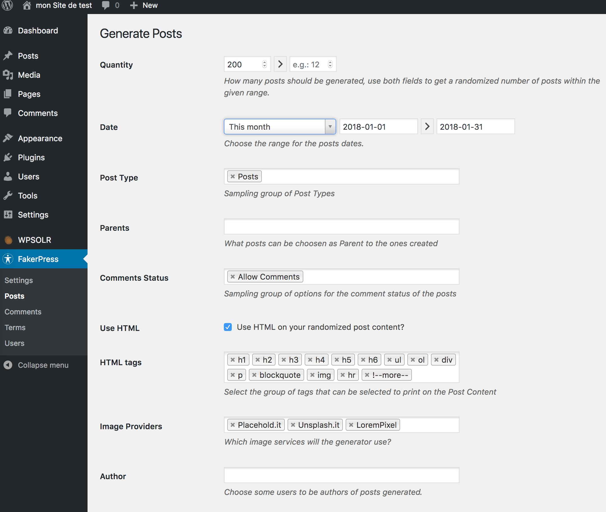

# TP SolR/Wordpress
Solr dans son mode d'utilisation le plus courant. C'est à dire en moteur de recherche.
##Mise en place des containers
Pour lancer la stack WP/SolR, on effectue un `docker-compose up -d`

Cela a exposé 3 ports de fonctionnement :

* Le port 80, accessible sur http://localhost où on trouvera le front Wordpress
* Le port 3306, pour accèder à la BDD mysql
* Le port 8983, http://localhost:8983 pour accèder à l'interface web de Solr

##Installation et configuration de wordpress
On suit les étapes de l'installation classique.
On va ensuite installer deux plugins wordpress: 

1. FakerPress (https://fr.wordpress.org/plugins/fakerpress/)
2. WPSolr (https://fr.wordpress.org/plugins/wpsolr-search-engine/)

### Ajout d'article de test
Une fois FakerPress activé, on va générer 200 posts. Pour celà on se rend dans le menu Post de FakerPress et on génère 200 posts, sur le mois passé.

###Configuration WpSolR

WpSolr necessite d'être configuré pour fonctionner correctement. Ci-après la configuration fonctionnelle dans le cadre de ce test docker.

L'application de cette configuration necessite la configuration préalable de de solR et de son index WPSOLR.

On vérifie le nom du container avec la commande `docker-compose ps`, puis on rentre en bash sur le container `docker exec -it dockersolrwp_solr_1 bash`

Puis on se rend dans le dossier `cd /opt/solr/server/solr/configsets`, on créé les dossiers `wpsolr` et `wpsolr/conf`. Et on met dans ce dossier les fichiers :

* elevate.xml
* schema.xml
* solrconfig.xml
* stopwords.txt

Le contenu des ces fichiers et visibles dans le dossier `solr-conf` de ce repo git.

Pour finir l'étape 0, on valide la conf.
###Definir le comportement du moteur

Il convient de configurer le comportement de WPSolr et ce qui va être synchroniser avec SolR. POur ça on renseigne les options suivantes :

* dans l'onglet Settings/Search with this search engine index : WPSOLR
* dans l'onglet Indexed data/Index post excerpt : coché
* dans l'onglet Indexed data/Post types to be indexed : All

On enregistre la conf et on passe à l'étape 2.
###Première synchro avec SolR
On selectionne tout, on lance la synchro et on laisse finir le taff par l'application.
###On active le moteur
On a des contenus, on indique à Wordpress qu'il peut utiliser wpSolr plutôt que son moteur. POur ça on revient à l'étape 1, et dans l'onglet settings on coche Replace WordPress default search by WPSOLR's.

##Free test et manipulation
On test ensemble le comportement du moteur et on observe et requète les changements dans l'UI solr.