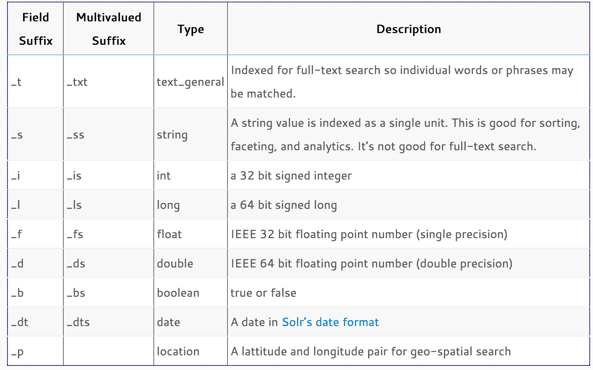
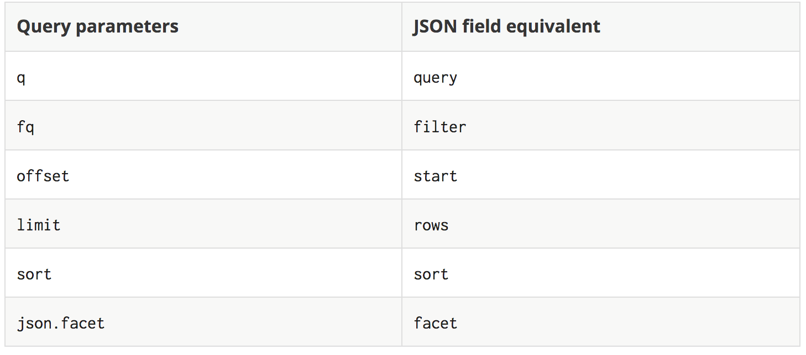
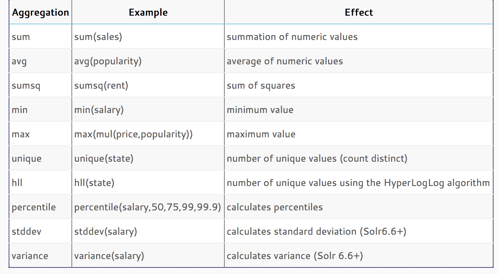

# SolR / TP0
La première prise en main de SolR.
##Les commande serveur de base
Une fois le container docker lancé, on s'y connecte en bash à l'aide de la commande `docker exec -it dockersolr_solr_1 bash`

On se retrouve dans le dossier :
`/opt/solr`.

Dans ce dossier on accède à l'executable en faisant `bin/solr`. Qui va pouvoir prendre les commandes start, stop, restart, status, create, create_core, create_collection, delete, version...

On va tester les commandes  status, version. Dans un premier temps.

On va maintenant créer notre collection pour ce TP0 qu'on va nommer demo

	bin/solr create -c demo

Cette commande a créé la collection demo. On la retrouve dans l'UI qu'on va au poitn suivant.
##L'interface web de SolR
SolR met à disposition une interface web qui permet d'accèder à de nombreuses informations sur le serveur SolR.

On y accède sur l'url [http://localhost:8983](http://localhost:8983)

On retrouvera la collection demo dans le menu "Core admin"et l'accès à cette démo dans le selecteur de Core.

##Manipulation de l'API avec Postman

Dans postman on va créer un POST dans `http://localhost:8983/solr/demo/update/json` avec en body de type JSON 
	
	[{"id" : "book1", "title_t" : "H2G2", "author_s" : "Douglas Adams"}]
	
Si on souhaite ajouter plusieurs livres d'un coup, on peut passer plusieurs livres à cette API :

	[{"id" : "book2", "title_t" : "La Huitième Couleur", "author_s" : "Terry Pratchett"},{"id" : "book3", "title_t" : "Le Huitième Sortilège", "author_s" : "Terry Pratchett"},{"id" : "book4", "title_t" : "La Huitième Fille", "author_s" : "Terry Pratchett"},{"id" : "book5", "title_t" : "Mortimer", "author_s" : "Terry Pratchett"},{"id" : "book6", "title_t" : "Sourcellerie", "author_s" : "Terry Pratchett"}]
	
A vous maintenant d'ajouter avec l'id "book7", votre livre préféré.

###C'était quoi déjà le livre book7 ?
On va récupérer les informations sur le book7 spécifiquement. Pour cela, on utilise Postman et on appelle en GET l'url suivante :

	http://localhost:8983/solr/demo/get?id=book7
##Typologie de champs
Il est important de typer les champs dans SolR afin d'optimiser les méthodes d'indexation et de requètages associé.

Plusieurs méthodes sont utilisables pour spécifier les types de champs d'une collection.
	
Le fichier schema.xml qui permet de spécifier en amont les typologie de contenu
L'API schema qui permet de gérer en API ce qu'on peut retrouver dans schema.xml
Les champs dynamique qui adapte leur type à la convention de nommage du champs via un suffixe. Par exemple, on a le champs author_s, ce champs est préfixé par _s qui signifie que ce champs sera interprété par l'indexeur comme une string

##Update d'un book
On va mettre à jour les informations du book2 avec quelques éléments nouveaux, pour cela, dans postman, on va réutiliser POST dans `http://localhost:8983/solr/demo/update/json` avec en body de type JSON.

	[
	 {"id"         : "book1",
	  "cat_s"      : { "add" : "Fantasy" },
	  "pubyear_i"  : { "add" : 1996 },
	  "ISBN_s"     : { "add" : " 2-905158-67-0" }
	 }
	]
Et on vérifie en faisant un GET 

	http://localhost:8983/solr/demo/get?id=book2
	
##Bientôt la première requète
On va importer quelques livres supplémentaires au format CSV pour notre première requète. Pour cela, toujours Postman en POST mais sur l'URL `http://localhost:8983/solr/demo/update/?jsoncommitWithin=5000` avec le body :

	id,cat_s,pubyear_i,title_t,author_s,series_s,sequence_i,publisher_s
	book8,fantasy,2010,The Way of Kings,Brandon Sanderson,The Stormlight Archive,1,Tor
	book9,fantasy,1996,A Game of Thrones,George R.R. Martin,A Song of Ice and Fire,1,Bantam
	book10,fantasy,1999,A Clash of Kings,George R.R. Martin,A Song of Ice and Fire,2,Bantam
	book11,sci-fi,1951,Foundation,Isaac Asimov,Foundation Series,1,Bantam
	book12,sci-fi,1952,Foundation and Empire,Isaac Asimov,Foundation Series,2,Bantam
	book13,sci-fi,1992,Snow Crash,Neal Stephenson,Snow Crash,,Bantam
	book14,sci-fi,1984,Neuromancer,William Gibson,Sprawl trilogy,1,Ace
	book15,fantasy,1985,The Black Company,Glen Cook,The Black Company,1,Tor
	book16,fantasy,1965,The Black Cauldron,Lloyd Alexander,The Chronicles of Prydain,2,Square Fish
	book17,fantasy,2001,American Gods,Neil Gaiman,,,Harper

Le paramètre jsoncommitWithin sert à spécifier qu'on souhaite que les datas soient disponibles pour la recherche dans 5 secondes. En effet, l'index n'est pas remis à jour en temps réel sur SolR.

##La première, elle est là
On va faire une recherche de dingue, on va récupérer le titre et l'auteur des livres qui contiennent le mot couleur. On récupère des données, on fait donc un GET dans postman :

	http://localhost:8983/solr/demo/query?q=title_t:couleur&fl=author_s,title_t

* q => query on demande que title_t contienne couleur
* fl => field list où on demande la liste des champs à retourner

Par contre, on a pas mal travailler en JSON jusqu'à maintenant, donc on va refaire la première mais en JSON

Pour reproduire la même requête en JSON, on va poster un JSON avec Postman à `http://localhost:8983/solr/demo/query`

	{
	  "query" : "title_t:couleur",
	  "fields" : ["title_t", "author_s"]
	}
	
On obtient le même résultat.

Voilà les équivalents query <=> json :

Issue de la doc officielle mais faux, il faut inverser limit et rows

##C'est pas tout ?
Bien sur que non. On va faire une requète avec un order et un limite. On appelle en post `http://localhost:8983/solr/demo/query` avec le JSON :
	
	{
	  "query" : "*:*",
	  "filter" : "publisher_s:Bantam",
	  "limit" : 3,
	  "sort" : "pubyear_i desc",
	  "fields" : "title_t, pubyear_i, publisher_s"
	}
	
la version request sera : `http://localhost:8983/solr/demo/query?q=*:*&fq=publisher_s:Bantam&rows=3&sort=pubyear_i desc&fl=title_t,pubyear_i,publisher_s`

#SOLR TP1

Le TP1 va consister en un import d'une base de film noté sur RottenTomatoes et l'utilisation des subtilité de typage et des fonctions d'aggrégation. On refera ensuite le même exercice avec des données choisis dans une base de CSV.

##Import des datas

On va créer la collection movies sur SolR. Pour cela, on se connecte au bash du container docker et on lance la commande `bin/solr create -c movies`, comme on l'a déjà expérimenté, cela créé le core/collection (solR/SolR cloud).

La configuration de la collection se situe dans `/opt/solr/server/solr/movies/conf`. On va faire en sorte de préparer notre import de data pour obtenir un schema 

	<!-- Fields added for rated_movies.csv load-->
	<field name="film" type="text" indexed="true" stored="true"/>
	<field name="year" type="pint" indexed="true" stored="true"/>
	<field name="stars" type="pfloat" indexed="true" stored="true"/>
	<field name="rating" type="pfloat" indexed="true" stored="true"/>
	<field name="votes" type="pint" indexed="true" stored="true"/>

Pour ce faire on peut utiliser l'API ou directement l'interface de gestion de SOLR `http://localhost:8983/solr/#/movies/schema`. Ce qu'on va faire.

Lorsque les configurations sont bonnes, on va sur `http://localhost:8983/solr/#/movies/files?file=managed-schema` pour constater que ça a marché et comprendre comme ça fonctionne.

On peut à présent importer le fichier. Pour cela, on va le faire en ligne de commande.

	bin/post -c movies share/rated_movies.csv

On retourne dans la interface solR pour constater que tout s'est importé :

	http://localhost:8983/solr/#/movies

##Manipulation de données
Dans cet exemple, on utilisera uniquement postman sur l'url de requète du core : `http://localhost:8983/solr/movies/query` en postant du JSON.
###Récupération d'un film
On va récupérer le film "jurassic world"

	{
	  "query" : "film:Jurassic"
	}
###Récupération d'un film (mode fuzzy)
Voyons voir si on peut retrouver les films qui contiennent le mot welcome mais ortographié par l'académie française : 

	{
	  "query" : "film:Welcaume~"
	}

###Recherche plain text d'un film
	{
	  "query" : "film:New York"
	}
###tous les films noté plus de 4 contenant le mot girl
	{
	  "query" : "film:girl",
	  "filter" : "rating:[4 TO *]"
	}

###Recherche des 5 films les mieux notés
	{
	  "query" : "*:*",
	  "limit" : 5,
	  "sort" : "rating asc"
	}
### recherche des 5 films les mieux notés ayant plus de 50 votes et classés par nombre de voyant décroissant en cas d'égalité
	{
	  "query" : "*:*",
	  "filter" : "votes:[50 TO *]"
	  "limit" : 5,
	  "sort" : "rating desc, votes desc"
	}
	
###Les facets
Les facets permettent de faire des opérations plus complexes dans les recherches proches des aggrégats SQL
####Moyenne des films de 2014
	{
	  "query" : "year:2014",
	  "facet": {
	  	"average_rating" : "avg(rating)"
	  }
	}

####Le nombre de film par note de plus de 3 sur l'année 2015 
	{
		"query" : "year:2015",
		"facet": {
			"rating_ranges": {
				"type" : "range",
				"field" : "rating",
				"start" : 3,
				"end" : 6,
				"gap" : 1
			}
		}
	}

#### Les nombre de films par année et les 2 années les plus représentés
Pour faire un range sur une chaine de caractère plutôt que sur un nombre, il faut utiliser le facet term. Par exemple :
	
	{
		"query" : "*:*",
		{
			"top_year" : { "terms" : "year" },
			"two_top_year" : {
				"type" : "terms",
				"field" : year,
				"limit" : 2,
				"mincount" : 2
			}
		}
	}

####La moyenne des films peu populaire (1 à 10 votes), moyennement populaire (11 à 999 votes) et très populaire (plus de milles votes)

	{
		"query" : "year:2015",
		"facet": {
			"low_popularity" : {
				"type" : "query",
				"q" : "votes:[1 TO 10]",
				"facet" : { "average_rating" : "avg(rating)" }
			},
			"med_popularity" : {
				"type" : "query",
				"q" : "votes:[11 TO 999]",
				"facet" : { "average_rating" : "avg(rating)" }
			}
			"high_popularity" : {
				"type" : "query",
				"q" : "votes:[1000 TO *]",
				"facet" : { "average_rating" : "avg(rating)" }
			}
		}
	}
####Pour aller plus loin sur les facets
Un très bon tutoriel et une bonne base sur SolR :
[http://yonik.com/json-facet-api/](http://yonik.com/json-facet-api/)

##Supression des datas (vidage de l'index)
Il peut être utile parfois de supprimer des données d'un index. Ci après l'exemple de la suppression de toutes les données : `http://localhost:8983/solr/movies/update/json?commit=true`

	{"delete":{"query":"*:*"}}

##Exercice
Il vous est demandé de créer un core sur le même container que le TP0 et le TP1

* créer le core tweets
* En vous aidant du petit fichier miniTweet.csv, typer les fields
* importer les datas dans share/tweets : BarackObama.csv et realDonaldTrump.csv
* Ajouter manuellement le dernier tweet en date de @realDonaldTrump et celui de @BarackObama
* Les 20 derniers tweets de la base par rapport à la date created_at
* les 20 tweets les plus favoris en mars 2017
* Les dates minimales et maximales de tweet de la collection
* Le nombre minimal de retweet pour trump
* Le nombre maximal de retweet pour Obama
* La moyenne de retweet pour trump en mars 2017 
* Chercher tous les tweets parlant de clinton
* Trouver la répartition des tweets sur clinton entre trump et obama
* Même question sur l'Obamacare
* Même question sur l'Obmacare en recherche approximative
* Les moyennes de replies,retweets,favorites pour les deux users
* Le nombre de tweets par interval de 1000 retweets
* Le nombre de tweets par interval de 1000 retweets uniquement sur 2015
* Supprimer tous les tweets de trump